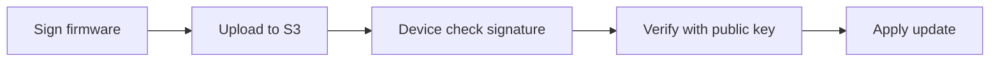

> [!abstract] Dari Sensor Sampai Cloud — Dimana Security-nya?
> Vault punya [[embodied-ai-robotics]] yang fokus ke robotics + AI, dan [[wireless-security-deepdive]] yang bahas RF attacks. Tapi gak ada yang ngejembatin antara IoT device fisik, edge gateway, dan cloud backend. Catatan ini bahas arsitektur edge computing dari lensa security — termasuk firmware signing, secure boot, OTA update, dan network segmentation buat OT/IIoT.

---

## 🏗️ 1. Arsitektur Edge Computing

```
[Sensors/Actuators] ←→ [Edge Gateway] ←→ [Cloud/Data Center]
       |                      |
  Zigbee/BLE/WiFi        MQTT/CoAP/HTTP
  (constrained)          (Linux/Rust/Python)
```

### 1.1 Tiers

| Tier                 | Hardware             | OS/Kernel               | Security Concern             |
| -------------------- | -------------------- | ----------------------- | ---------------------------- |
| **Tier 1 — Sensors** | ESP32, nRF52840      | RTOS / bare-metal       | Physical tamper, weak crypto |
| **Tier 2 — Gateway** | RPi, Jetson, x86 SBC | Linux (Yocto/Buildroot) | Supply chain, OTA poisoning  |
| **Tier 3 — Cloud**   | VM/Kubernetes        | Standard OS             | API auth, data privacy       |

---

## 🔒 2. Attack Surface IoT

### 2.1 Firmware Security

**Masalah umum:**

- Firmware gak di-sign → attacker inject malicious firmware
- Hardcoded credentials → ambil dari binwalk
- No secure boot → boot chain bisa dimodifikasi

**Mitigasi:**

- **Secure Boot** — verified boot chain (uBoot → kernel → rootfs)
- **Firmware signing** — RSA/Ed25519 signature verify sebelum boot
- **TPM/HSM** — hardware-backed key storage

Lihat [[firmware-reverse-engineering-deepdive]] buat cara reverse engineer firmware yang gak secure.

### 2.2 Network Segmentation

```
IoT VLAN (192.168.10.0/24)
  └── Hanya bisa ke MQTT broker (port 8883)
  └── No internet access langsung
  └── Rate-limited (10 packets/s per device)

Production VLAN (10.0.0.0/24)
  └── Bisa ke MQTT broker + database
  └── Firewall: reject all dari IoT VLAN kecuali MQTT
```

### 2.3 OTA Update Security



**Top threats:**

- **Rollback attack** — attacker paksa device pake firmware lama yang vulnerable
- **Man-in-the-middle** — OTA over HTTP → firmware di-intercept
- **Supply chain** — kompromi di build server

---

## 🔗 Koneksi

- [[embodied-ai-robotics]] — robotics AI = subset dari edge computing
- [[wireless-security-deepdive]] — RF layer untuk IoT communication
- [[firmware-reverse-engineering-deepdive]] — RE skill buat audit IoT firmware
- [[desain-sistem-otonom]] — sistem otonom = edge AI + real-time decision
- [[hardware-hacking-re]] — physical access ke IoT device
- [[container-kubernetes-security-deepdive]] — cloud side dari edge architecture
