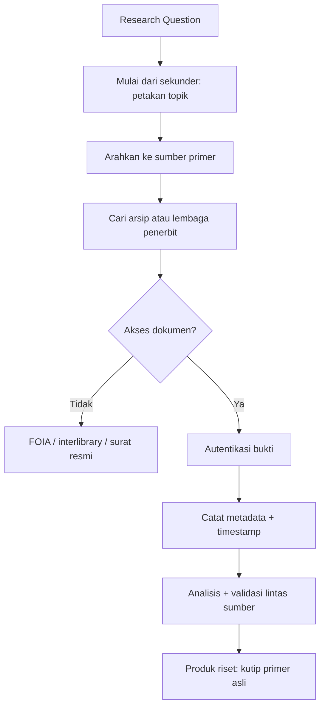

> [!abstract] Definisi
> Riset yang kuat dibangun dari sumber primer — bukti asli yang dibuat pada masa kejadian, bukan interpretasi orang lain. Dokumen ini membedah hierarki sumber (primer vs sekunder vs tersier), cara menemukan dan mengevaluasi arsip, teknik riset arsip, cara membaca dokumen yang di-redact, dan bahaya bias. Ini melengkapi research-methodology.md yang berhenti di literature review — melangkah lebih dalam ke sumber-sumber asli.

---

## 📑 Daftar Isi

1. [[#1. Hierarki Sumber]]
2. [[#2. Jenis Sumber Primer]]
3. [[#3. Arsip Nasional dan Institusi Arsip]]
4. [[#4. Dokumen Terdeklasifikasi dan Kebebasan Informasi]]
5. [[#5. Mengevaluasi Sumber Primer]]
6. [[#6. Teknik Riset Arsip]]
7. [[#7. Data Mentah sebagai Sumber Primer]]
8. [[#8. Arsip Digital dan Born-Digital]]
9. [[#9. Kesalahan Umum dan Studi Kasus]]
10. [[#10. Etika Penggunaan Sumber Primer]]
11. [[#11. Workflow Riset Sumber Primer]]
12. [[#Referensi dan Cross-link]]

---

## 1. Hierarki Sumber: Primer, Sekunder, Tersier

Memahami hierarki ini adalah fondasi riset sumber primer — membedakan bukti asli dari interpretasi.

| Jenis        | Definisi                                                  | Contoh                                                                | Kekuatan                           | Kelemahan                               |
| ------------ | --------------------------------------------------------- | --------------------------------------------------------------------- | ---------------------------------- | --------------------------------------- |
| **Primer**   | Bukti dibuat pada saat kejadian atau oleh pelaku langsung | Surat, diary, dokumen resmi, dataset, artefak, kode sumber, wawancara | Otentik, detail, tidak dimediasi   | Bisa bias, tidak lengkap, butuh konteks |
| **Sekunder** | Analisis atau interpretasi sumber primer oleh pihak lain  | Buku sejarah, review paper, biografi, artikel jurnal                  | Sudah disintesis, punya perspektif | Membawa interpretasi penulis            |
| **Tersier**  | Kompilasi atau ringkasan sumber sekunder                  | Ensiklopedia, textbook, Wikipedia                                     | Mudah dipahami, ringkas            | Jauh dari bukti asli, berlapis bias     |

> [!danger] Golden Rule
> Selalu telusuri klaim ke sumber primer. Jika kamu mengutip "menurut buku X", temukan dokumen asli yang dikutip buku itu. Kutipan dari kutipan adalah kesalahan paling umum dan paling berbahaya dalam riset.

> [!tip] Analogi untuk Teknologi
> Untuk pengembang: **source code asli** = sumber primer; **dokumentasi resmi** = sekunder; **tutorial atau blog** = tersier. Debug yang efisien selalu kembali ke source code, bukan ke blog post.

---

## 2. Jenis Sumber Primer

Sumber primer tidak selalu "dokumen tua". Dalam konteks riset modern:

- **Dokumen resmi** — surat, memorandum, laporan, sertifikat, kontrak.
- **Data mentah** — dataset, log server, network capture, telemetry sensor.
- **Artefak fisik** — prototipe, hardware, benda sejarah.
- **Citra** — foto, satelit imagery, radiograph.
- **Audiovisual** — rekaman, podcast, video wawancara.
- **Sumber lisan** — wawancara, kesaksian, oral history.
- **Kode dan software** — source code historis, binary, commit log.
- **Komunikasi** — email, chat, surat, memo internal.

---

## 3. Arsip Nasional dan Institusi Arsip

Arsip adalah rumah sumber primer. Ada hierarki institusi tempat kamu mencari.

**Arsip nasional (prioritas tinggi):**

| Negara          | Institusi                      | Catatan                               |
| --------------- | ------------------------------ | ------------------------------------- |
| Amerika Serikat | **NARA** (National Archives)   | Sejarah intelijen, dokumen federal    |
| Inggris         | **UK National Archives**       | 30-year rule, Colonial Office records |
| Indonesia       | **ANRI** (Arsip Nasional RI)   | Arsip negara Indonesia                |
| Belanda         | **National Archief / NIOD**    | Arsip kolonial dan pendudukan         |
| Jepang          | **National Archives of Japan** | Akses terbatas                        |
| Prancis         | **Archives nationales**        | Arsip pemerintahan dan kolonial       |

**Repositori riset besar:**

- **Library of Congress** (AS) — koleksi riset terbesar dunia.
- **British Library** (Inggris) — koleksi manuskrip dan buku langka.
- **Internet Archive / Wayback Machine** — arsip web, snapshot historis.
- **GitHub Archives** — sejarah kode dan commit (sumber primer untuk software).

---

## 4. Dokumen Terdeklasifikasi dan Kebebasan Informasi

Kunci riset sejarah intelijen dan pemerintahan.

| Metode                                    | Cara Kerja                         | Akses                                    |
| ----------------------------------------- | ---------------------------------- | ---------------------------------------- |
| **FOIA** (Freedom of Information Act, AS) | Permintaan publik dokumen federal  | Berbayar atau gratis, hasilnya di-redact |
| **30-year rule** (Inggris)                | File dibuka setelah 30 tahun       | Gratis di National Archives              |
| **CIA FOIA Reading Room**                 | Laporan intelijen terdeklasifikasi | Gratis online                            |
| **NSA Declassification**                  | Sejarah SIGINT                     | Gratis online                            |
| **Archive.org / FOIA libraries**          | Hasil FOIA yang dipublikasikan     | Gratis                                   |
| **Wikileaks**                             | Dokumen yang diterbitkan kembali   | Kontroversial, gunakan secara kritis     |

> [!warning] Penting
> Terdeklasifikasi tidak berarti transparan. Dokumen **di-redact** (bagian dihitamkan) dan hanya **sebagian** yang dipilih untuk dibuka. Analis harus sadar akan seleksi dan redaction — apa yang tidak ada sering sama pentingnya dengan apa yang ada.

---

## 5. Mengevaluasi Sumber Primer

Tidak semua dokumen otentik atau relevan. Gunakan tes berikut:

| Tes                   | Pertanyaan Kunci                     | Contoh Gagal                       |
| --------------------- | ------------------------------------ | ---------------------------------- |
| **Otentikasi**        | Apakah dokumen asli atau palsu?      | Dokumen palsu, hasil reproduce     |
| **Tanggal dan versi** | Kapan dibuat? Revisi terakhir?       | Dokumen usang diklaim terbaru      |
| **Otoritas**          | Siapa penulis atau lembaga penerbit? | Dokumen anonim tanpa bukti         |
| **Konteks**           | Kondisi saat dibuat? Untuk siapa?    | Dokumen rahasia vs rilis publik    |
| **Chain of Custody**  | Dari mana dokumen didapat? Diedit?   | Screenshot yang diedit (Photoshop) |

**Metode autentikasi digital:**

1. **Hash verification** — hitung SHA-256 dokumen saat pertama diunduh; bandingkan dengan sumber resmi jika ada.
2. **Metadata forensik** — periksa EXIF (foto), document properties (PDF/Office), timestamp. Metadata bisa bohong tapi sering jadi petunjuk.
3. **OCR sanity check** — teks hasil OCR bisa salah baca (angka "0" menjadi huruf "O"). Bandingkan dengan scan asli untuk dokumen kritis.
4. **Validasi lintas sumber** — jika satu dokumen kontradiktif dengan semua sumber lain, curigai.

> [!info] Otentik vs Benar
> Dokumen bisa **otentik** (asli) tapi **salah** (faktanya keliru, penulisnya bias, atau konteksnya berbeda). Autentikasi hanya membuktikan dokumen itu asli — kebenaran tetap butuh analisis konteks dan validasi silang.

---

## 6. Teknik Riset Arsip

Di arsip kertas maupun digital, tekniknya mirip.

### Strategi Pencarian

1. **Identifikasi lembaga** — temukan koleksi atau arsip di institusi resmi.
2. **Cari finding aid** — panduan berisi daftar box dan folder; periksa sebelum datang.
3. **Telusuri sistematis** — mulai dari koleksi besar, lalu turun ke detail.
4. **Kumpulkan salinan digital** dengan metadata lengkap.

### Verifikasi Lintas Sumber

Satu dokumen tidak pernah cukup. Terima klaim hanya jika didukung oleh sumber independen. Contoh: klaim kebijakan perusahaan diverifikasi dari (1) memo internal, (2) press release, (3) laporan media kontemporer, (4) data ekonomi. Jika hanya satu sumber mendukung, tandai _unverified_.

### Membaca Dokumen yang Di-redact

1. **Perhatikan pola redaction** — bagian yang dihitamkan sering mengungkap topik sensitif.
2. **Bandingkan versi** — dua salinan dengan redaction berbeda bisa mengungkap isi.
3. **Cari dokumen pendamping** — cover letter atau minutes sheet kadang tidak di-redact.
4. **Jangan menebak** — redaction berarti tidak ada bukti; jangan mengisi tebakan.

> [!tip] Disiplin Metadata
> Catat 5 hal untuk setiap dokumen: **tanggal** (dibuat dan diunduh), **sumber** (URL, arsip, box), **koleksi** (nama fonds atau series), **identifikasi** (nomor box/folder), **kontak arsip** (nama arsiparis). Tanpa metadata, dokumen kehilangan nilai bukti.

---

## 7. Data Mentah sebagai Sumber Primer

Untuk riset keamanan dan recovery, **log mentah dan telemetry** adalah sumber primer utama.

| Data                 | Contoh                           | Keaslian                   |
| -------------------- | -------------------------------- | -------------------------- |
| **Log server**       | Access log, error log, audit log | Langsung dari server       |
| **Sensor telemetry** | IoT, GPS, network capture (pcap) | Langsung dari device       |
| **Dataset mentah**   | CSV, JSON, SQL dump              | Kualitas tergantung sumber |
| **Source code**      | Git repository, binary           | Kode asli                  |
| **Forensic image**   | dd, memdump, disk image          | Salinan bit-perfect        |

> [!danger] Chain of Custody
> Data mentah adalah bukti. Analisis dilakukan pada **salinan**, bukan file orisinal. Catat hash tamper-evidence (SHA-256) di awal dan dokumentasikan siapa yang mengakses. Tanpa chain-of-custody, data tidak sah sebagai bukti.

### Studi Kasus: Riset Insiden dari Log

1. **Collection** — salin access log dan error log (jangan analisis file asli).
2. **Preservation** — hitung hash (`sha256sum access.log > hash.txt`); simpan file asli read-only.
3. **Analysis** — ekstrak IP, pola request, timeline; buat pivot table.
4. **Correlation** — hubungkan dengan WAF log dan IDS alert.
5. **Report** — kutip nomor baris log asli sebagai bukti primer.

Hasilnya: laporan insiden yang reproducible — siapa pun bisa memverifikasi dari log mentah.

---

## 8. Arsip Digital dan Born-Digital

Sebagian besar arsip kini digital — _born-digital_ (diciptakan digital) berbeda dari _digitized_ (scan dokumen fisik).

| Aspek        | Digitized                 | Born-Digital                        |
| ------------ | ------------------------- | ----------------------------------- |
| **Definisi** | Scan dokumen fisik        | Diciptakan langsung digital         |
| **Keaslian** | Kualitas scan             | Original absolut                    |
| **Metadata** | OCR dan manual            | Kaya, otomatis                      |
| **Risiko**   | Error OCR                 | Format usang, bit-rot               |
| **Contoh**   | Scan buku kuno, microfilm | Email, database, kode, foto digital |

**Arsip digital utama:**

- **Internet Archive** — ratusan miliar halaman web (Wayback Machine).
- **Common Crawl** — dataset web terbuka untuk riset.
- **Hathitrust** — jutaan item dari Google Books.
- **Memento / Timbco** — web archive interoperable.

---

## 9. Kesalahan Umum dan Studi Kasus

### Kesalahan umum

| Kesalahan                                 | Dampak                   | Pencegahan             |
| ----------------------------------------- | ------------------------ | ---------------------- |
| Mengutip sekunder padahal primer tersedia | Kehilangan konteks asli  | Selalu cek sumber asli |
| Salah atribusi (narasumber vs penulis)    | Klaim salah              | Cek metadata lengkap   |
| Mengabaikan bias sumber                   | Kesimpulan miring        | Cek pendanaan & agenda |
| Tanggal salah / tanpa timestamp           | Verifikasi gagal         | Catat tanggal akses    |
| Screenshot tanpa URL                      | Tidak dapat diverifikasi | Simpan URL + tanggal   |
| Dokumen tanpa hash                        | Chain of custody rusak   | Hash setiap file       |

### Studi kasus: investigasi berbasis sumber primer

**Kasus 1 — MH17 (2014):** Analis Bellingcat menggunakan foto geotag publik (sumber primer) + data radar terbuka + metadata untuk membuktikan lokasi peluncuran rudal. Pelajaran: **sumber primer tunggal tidak cukup** — konvergensi banyak sumber primer independen yang membangun kredibilitas.

**Kasus 2 — Panama Papers (2016):** 11,5 juta dokumen bocor (sumber primer) dianalisis oleh konsorsium jurnalis. Pelajaran: **dokumen primer mentah bernilai besar** — tapi butuh normalisasi, dedupe, dan cross-check sebelum dipublikasikan.

**Kasus 3 — Nixon Tapes (1974):** Rekaman audio (sumber primer) menjadi bukti kunci Watergate. Pelajaran: **sumber primer bisa mengubah sejarah** — rekaman audio/video punya bobot berbeda dari memo.

> [!important] Kesimpulan
> Sumber primer adalah fondasi investigasi — tetapi **tanpa metode** (hash, timestamp, cross-check, chain of custody) nilainya hilang. Primer + metode = bukti. Primer tanpa metode = klaim.

---

## 10. Etika Penggunaan Sumber Primer

| Aspek                | Prinsip                                                   |
| -------------------- | --------------------------------------------------------- |
| **Hak cipta**        | Dokumen arsip bisa dilindungi hak cipta — cek lisensi     |
| **Privasi**          | Dokumen pribadi (medis, finansial) wajib dilindungi       |
| **Declassification** | Dokumen masih terklasifikasi = tidak boleh dipublikasikan |
| **Kontekstualisasi** | Jangan kutip di luar konteks                              |
| **Attribution**      | Selalu sebut sumber & lokasi arsip                        |
| **Dampak**           | Pertimbangkan dampak publikasi pada individu              |

> [!warning]
> Akses legal ≠ hak publikasi. Banyak arsip nasional mengizinkan **membaca** tapi melarang **mengutip/menyalin** tanpa izin. Cek ketentuan repositori sebelum publikasi.

---

| Kesalahan                   | Ciri                     | Fix                       |
| --------------------------- | ------------------------ | ------------------------- |
| **Kutip dari kutipan**      | "Menurut X (dalam Y)"    | Telusuri ke sumber primer |
| **Sekunder sebagai primer** | Textbook diklaim faktual | Cari sumber asli          |
| **Tanpa tanggal**           | Sumber tanpa timestamp   | Catat tanggal             |
| **Tanpa konteks**           | Kutipan terisolasi       | Periksa paragraf lengkap  |
| **Bias seleksi**            | Hanya mencari yang cocok | AHC: hipotesis saingan    |
| **Arsip selektif**          | Arsip tidak lengkap      | Teliti apa yang hilang    |

### Studi Kasus Terkenal

- **Hitler Diaries (1983)** — majalah _Stern_ menerbitkan "diary Hitler" yang ternyata palsu; kertas dan tinta modern. **Pelajaran:** autentikasi forensik (kertas, tinta, tulisan tangan) wajib sebelum publikasi besar.
- **Climategate (2009)** — email ilmuwan iklim dikutip di luar konteks. **Pelajaran:** kutipan tanpa konteks menyesatkan; selalu cek konteks penuh.
- **Fake news 2016+** — foto dan dokumen palsu disebar dengan konteks salah. **Pelajaran:** verifikasi sumber, tanggal, dan lokasi sebelum share.

> [!danger] Fakta Kunci
> Sumber primer adalah jaminan **otentisitas**, bukan kebenaran. Analisis yang baik menempatkan sumber primer dalam konteks, memverifikasi lintas sumber, dan mengakui ketidakpastian.

---

## 11. Workflow Riset Sumber Primer

---

## Referensi dan Cross-link

- [[research-methodology]] — proses riset, literature review, IMRaD
- [[academic-research-sources-encyclopedia]] — sumber pengetahuan akademik
- [[intelligence-reporting-sources-and-tradecraft]] — tradecraft intelijen dan arsip terdeklasifikasi
- [[hierarchy-search]] — cache dan archive web (Level 1)
- [[osint-resource-index]] — daftar sumber intelijen nasional

**Metadata**

- **Tags:** research primary-sources archives declassified forensik methodology
- **Related:** [[research-methodology]], [[academic-research-sources-encyclopedia]], [[intelligence-reporting-sources-and-tradecraft]]
- **Last Updated:** 2026-08-02
