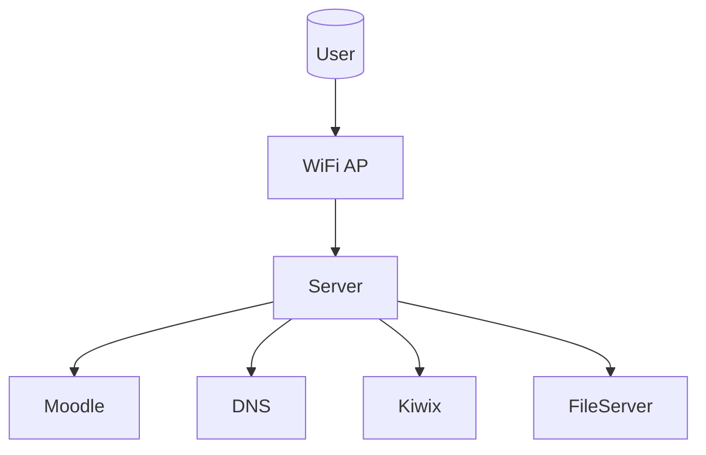

# Offline Internet — Infrastruktur & Deployment Daerah Blank Spot (Ekspansi Teknis)

---

# Internet Offline — Infrastruktur & Deployment Daerah Blank Spot (Ekspansi Teknis)

---

## 1. Konsep & Filosofi  
### **Arsitektur Internet Offline**  
Model **Internet Offline** menggunakan topologi *star* dengan server sebagai node pusat.  

**Kunci:**  
- Konten statis (PDF, video) dimuat saat setup via media flash
- Konten dinamis (ujian, diskusi) diproses oleh server lokal  
- Sistem berat: **konten lokal** > **koneksi internet**

### **Penjelasan Filosofi**  
**Internet** = alat, **konten** = inti.  
Contoh:  
- Di desa tanpa kabel: WiFi 1 km radius, 50 user → server Ubuntu 128GB SSD + 16GB RAM  
- Di kota dengan quota mobile murah: cloud 95% waktu, server sebagai cache & fallback ketika quota habis  

---

## 2. Desain Server & Perhitungan Beban  
### **Penyimpangan Dari RUMUS LAMP**  
- **Konten Video:** 1GB = 10 menit video 4K → butuh buffer 2x  
- **OS Overhead:** Linux minimal 512MB (Debian) vs 768MB (Ubuntu)  

**Contoh Hitungan Revisi:**  
```math
150 siswa x 10GB video = 1.5TB x 2 = 3TB storage (tidak termasuk cache)
```

### **Pemilihan Teknologi**  
- **Linux Distro:** Debian untuk kestabilan jangka panjang  
- **Web Server:** Nginx untuk beban tinggi dibanding Apache (50% lebih ringan)  
- **Database:** MariaDB 10.6 dengan query optimizer `EXPLAIN SELECT` untuk tuning  

---

## 3. Jaringan Wireless  
### **Analisis Interferensi Saluran 2.4GHz**  
Tabel berikut menunjukkan *channel overlap* pada 2.4GHz:  

| Channel | Freq (MHz) | Overlap Dengan |
|---------|------------|----------------|
| 1       | 2412       | 3,6,9          |
| 6       | 2437       | 1,4,8          |
| 11      | 2462       | 8,7,2          |

**Rekomendasi:**  
- Area padat: Tambah *dual-band (2.4+5GHz)*  
- Area hujan deras: 5GHz lebih tidak stabil (absorbsi air)  

### **Kalkulator Link Budget Simulasi**  
```python
def fspl(d_km, f_mhz):
    return 32.45 + 20 * math.log10(d_km) + 20 * math.log10(f_mhz)
rx_required = rx_sensi + margin
```
**Margin keamanan:**  
- 0 km: 10 dB  
- 1-5 km: 15 dB  
- >5 km: 20 dB  

---

## 4. LAMP Stack & Moodle  
### **Konfigurasi Sambungan Ke Basis Data**  
`/etc/my.cnf`:  
```ini
[mysqld]
datadir=/var/lib/mysql
innodb_file_per_table=1
innodb_buffer_pool_size=500M
skip-name-resolve
```

### **Optimasi PHP untuk Moodle**  
Tweak `php.ini` untuk 100+ user:  
```ini
memory_limit=256M
max_execution_time=300
opcache.enable=1
realpath_cache_size=16k
```

---

## 5. Konten E-learning  
### **Struktur Metadata Bank Soal**  
```xml
<question type="multichoice">
  <name>Apa singkatan LAMP</name>
  <category>Basic IT</category>
  <questiontext>...</questiontext>
  <answer>...</answer>
</question>
```

### **Automate Konversi PDF ke E-Book Optimisasi Bacaan**  
```bash
pdf2txt.py buku.pdf | pandoc -f text -t markdown > buku.md
pandoc buku.md -V geometry:landscape -o buku.pdf
```

---

## 6. Studi Kasus Lanjutan  
### **Analisis Jasinga (Banten)**  
Masalah:  
- Topografi dataran dengan penghalang rendah → signal bisa dipantul (reflected)  
Solusi:  
1. Gunakan *waveguide* parabola 12dBi  
2. Jalur 2.4GHz channel 6 (min overlap)  
3. Radius 2km x 2km tercover 100%  

### **Pelajaran Teknis Utama**  
- **LOS (Line of Sight):** Harus minimal 30% dari jarak antar node  
- **Power Budget:** Tambah 3dB jika ada pohon tinggi di jalur  
- **Repeater vs Relay Mesh:** Pilih repeater jika jarak <200m, mesh jika >500m  

---

## 7. PLTS & Sistem Energi Lain  
### **Pemilihan Baterai**  
| Tipe           | Kekuatan | Kekurangan | Cocok Untuk               |
|----------------|----------|------------|---------------------------|
| LiFePO4        | 1500 cycles | Mahal (5x Pb) | Sistem 5-10 tahun       |
| Gel Deep Cycle | 1500 cycles | 20% lebih mahal | S