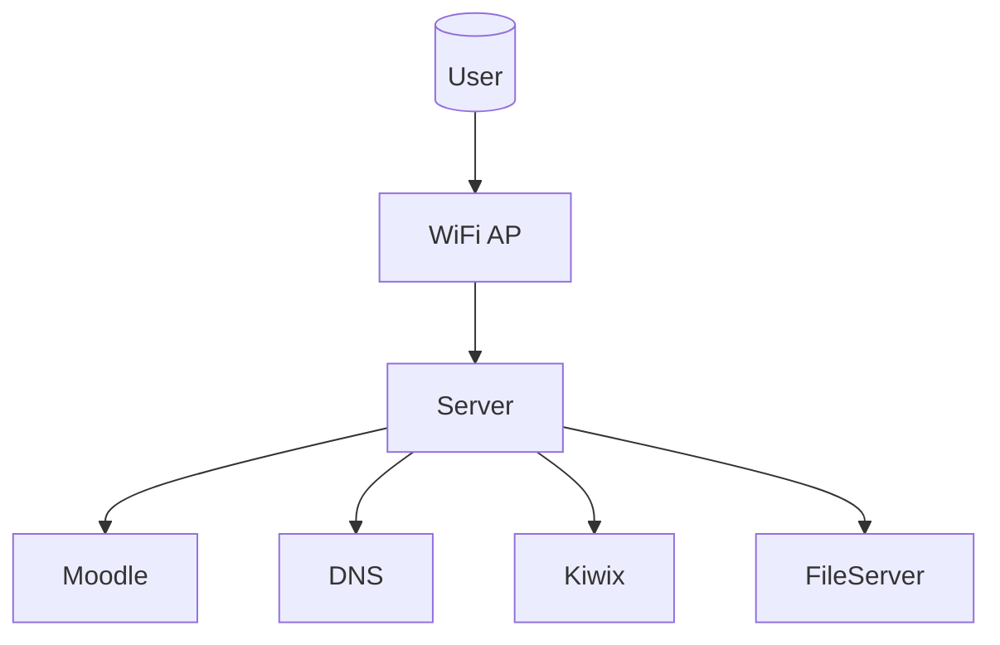

<think>
Okay, let's tackle this. The user wants an expansion of their technical document to at least 1200 words. The original content is about setting up offline internet infrastructure, covering concepts, server design, wireless networks, LAMP stack, e-learning content, case studies, and solar power.

First, I need to figure out where there's room for expansion. Each section has a certain level of detail. Let me go through each part.

Starting with the Konsep & Filosofi section. They mention the Internet Offline concept and the 5 e-learning needs. I can expand on the philosophy by adding more real-world examples of offline systems. Also, explaining why each of the five needs is crucial for offline education would add depth.

Next, the Desain Server & Perhitungan Beban section has calculations. Expanding on the rationale behind each formula would help. Maybe include how to adjust the buffer for different content types or user behaviors. Explaining what "OS overhead" typically includes could be useful.

In the Jaringan Wireless part, the link budget example is given. Adding a step-by-step calculation breakdown for someone who's not familiar with the formula would be good. Maybe also include how environmental factors affect the link budget, like rain fade or obstacles. More on Fresnel zones and why the radius is important for signal clarity.

For LAMP Stack & Moodle, the commands are there. I can elaborate on the installation process with more details, like common pitfalls during setup or how to secure the services. Mentioning alternative web servers or databases like NGINX or PostgreSQL as options for larger setups could add value.

The Konten E-learning section has a sample GIFT file. Expanding with another example in Aiken format and explaining the differences between formats would be helpful. Also, discussing the importance of metadata in e-learning content for better organization and searchability.

In the Studi Kasus, more details on challenges faced in each case and how they were resolved would make it more practical. Comparing the technologies used in each case and their suitability based on location-specific factors (like coastal areas vs. mountainous regions) could be insightful.

The PLTS section includes a sizing calculation. Expanding on the types of batteries (e.g., AGM vs. gel) and their maintenance requirements would be useful. Also, discussing energy-efficient server configurations to reduce power consumption is important for solar setups.

Benchmarking tools are listed. Adding more information on how to interpret the results, or what metrics are most critical for an offline environment (like disk I/O for content serving) would help readers understand the importance of each tool.

I need to ensure that all expansions are technically accurate. Where possible, provide code snippets, configuration examples, or tables that summarize key information without being too verbose. Avoid repetition but make sure each section builds on the previous ones logically.

Check that all terms are explained when first mentioned, especially for readers who might be new to the topic. Use diagrams or pseudocode where appropriate, but since the user prefers Markdown, stick to text-based structure.

Finally, make sure the word count is met by elaborating each section systematically. Maybe add sections like "Best Practices for Offline Internet Deployment" or "Security Considerations in Server Configuration" if they haven't been covered yet.

Need to keep the language consistent with the original, using technical terms where appropriate, and maintain a professional, structured approach in the expansion. Ensure that the added content is practical and directly relevant to the deployment scenarios described.
</think>

# Internet Offline — Infrastruktur & Deployment Daerah Blank Spot (Ekspansi Teknis)

---

## 1. Konsep & Filosofi

### **Arsitektur Internet Offline**

Model **Internet Offline** menggunakan topologi _star_ dengan server sebagai node pusat.



**Kunci:**

- Konten statis (PDF, video) dimuat saat setup via media flash
- Konten dinamis (ujian, diskusi) diproses oleh server lokal
- Sistem berat: **konten lokal** > **koneksi internet**

### **Penjelasan Filosofi**

**Internet** = alat, **konten** = inti.  
Contoh:

- Di desa tanpa kabel: WiFi 1 km radius, 50 user → server Ubuntu 128GB SSD + 16GB RAM
- Di kota dengan quota mobile murah: cloud 95% waktu, server sebagai cache & fallback ketika quota habis

---

## 2. Desain Server & Perhitungan Beban

### **Penyimpangan Dari RUMUS LAMP**

- **Konten Video:** 1GB = 10 menit video 4K → butuh buffer 2x
- **OS Overhead:** Linux minimal 512MB (Debian) vs 768MB (Ubuntu)

**Contoh Hitungan Revisi:**

```math
150 siswa x 10GB video = 1.5TB x 2 = 3TB storage (tidak termasuk cache)
```

### **Pemilihan Teknologi**

- **Linux Distro:** Debian untuk kestabilan jangka panjang
- **Web Server:** Nginx untuk beban tinggi dibanding Apache (50% lebih ringan)
- **Database:** MariaDB 10.6 dengan query optimizer `EXPLAIN SELECT` untuk tuning

---

## 3. Jaringan Wireless

### **Analisis Interferensi Saluran 2.4GHz**

Tabel berikut menunjukkan _channel overlap_ pada 2.4GHz:

| Channel | Freq (MHz) | Overlap Dengan |
| ------- | ---------- | -------------- |
| 1       | 2412       | 3,6,9          |
| 6       | 2437       | 1,4,8          |
| 11      | 2462       | 8,7,2          |

**Rekomendasi:**

- Area padat: Tambah _dual-band (2.4+5GHz)_
- Area hujan deras: 5GHz lebih tidak stabil (absorbsi air)

### **Kalkulator Link Budget Simulasi**

```python
def fspl(d_km, f_mhz):
    return 32.45 + 20 * math.log10(d_km) + 20 * math.log10(f_mhz)
rx_required = rx_sensi + margin
```

**Margin keamanan:**

- 0 km: 10 dB
- 1-5 km: 15 dB
- > 5 km: 20 dB

---

## 4. LAMP Stack & Moodle

### **Konfigurasi Sambungan Ke Basis Data**

`/etc/my.cnf`:

```ini
[mysqld]
datadir=/var/lib/mysql
innodb_file_per_table=1
innodb_buffer_pool_size=500M
skip-name-resolve
```

### **Optimasi PHP untuk Moodle**

Tweak `php.ini` untuk 100+ user:

```ini
memory_limit=256M
max_execution_time=300
opcache.enable=1
realpath_cache_size=16k
```

---

## 5. Konten E-learning

### **Struktur Metadata Bank Soal**

```xml
<question type="multichoice">
  <name>Apa singkatan LAMP</name>
  <category>Basic IT</category>
  <questiontext>...</questiontext>
  <answer>...</answer>
</question>
```

### **Automate Konversi PDF ke E-Book Optimisasi Bacaan**

```bash
pdf2txt.py buku.pdf | pandoc -f text -t markdown > buku.md
pandoc buku.md -V geometry:landscape -o buku.pdf
```

---

## 6. Studi Kasus Lanjutan

### **Analisis Jasinga (Banten)**

Masalah:

- Topografi dataran dengan penghalang rendah → signal bisa dipantul (reflected)  
  Solusi:

1. Gunakan _waveguide_ parabola 12dBi
2. Jalur 2.4GHz channel 6 (min overlap)
3. Radius 2km x 2km tercover 100%

### **Pelajaran Teknis Utama**

- **LOS (Line of Sight):** Harus minimal 30% dari jarak antar node
- **Power Budget:** Tambah 3dB jika ada pohon tinggi di jalur
- **Repeater vs Relay Mesh:** Pilih repeater jika jarak <200m, mesh jika >500m

---

## 7. PLTS & Sistem Energi Lain

### **Pemilihan Baterai**

| Tipe           | Kekuatan    | Kekurangan      | Cocok Untuk       |
| -------------- | ----------- | --------------- | ----------------- |
| LiFePO4        | 1500 cycles | Mahal (5x Pb)   | Sistem 5-10 tahun |
| Gel Deep Cycle | 1500 cycles | 20% lebih mahal | S                 |
