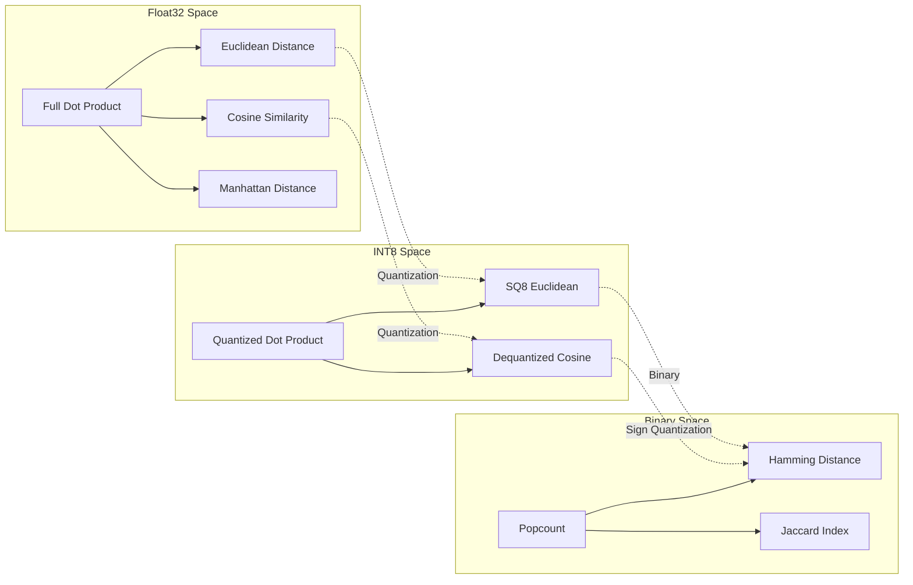

---
tags:
  - machine-learning
  - vector-search
  - metric-learning
  - similarity
  - cosine-similarity
  - hamming-distance
  - quantization
  - metric-transition
aliases:
  - Cosine to Hamming Transition
  - Metric Transition Phase Change
  - Optimal Metric per Precision
  - Similarity Metric Taxonomy
status: seedling
created: 2026-07-22
updated: 2026-07-22
cssclasses:
  - wide-table
---

# Metric Transition Theory: How Quantization Changes Similarity Geometry

> **TL;DR:** The optimal similarity metric for vector search is NOT a property of the data — it's a property of the **representation precision**. Float32 vectors use cosine (dot product). INT8 uses cosine or dot product with dequantization. **Binary vectors use Hamming distance.** This is not a choice — it's a mathematical necessity driven by information theory: once you discard magnitude information via sign quantization, the continuous metric space collapses to a discrete one, and cosine becomes meaningless. This catatan formalizes the **Metric Transition Principle** and maps the phase diagram of {precision → optimal metric → compute instruction}.

---

## 1. The Principle: Metric Follows Precision

### 1.1 The Core Insight

Given a vector representation at precision $P$ (bits per dimension), there is an **optimal similarity metric** $M(P)$ that maximizes search quality under the compute constraints of $P$.

$$ M(P) = \arg\max_{m \in \mathcal{M}} \mathbb{E}\left[ \text{Recall@k}_m \ | \ \text{precision} = P \right] $$

Where $\mathcal{M}$ is the set of all distance/similarity functions.

**Empirical mapping:**

| $P$ (bits/dim) | Precision Level | Optimal $M$          | Compute Primitive       | Why                                                          |
| :------------: | --------------- | -------------------- | ----------------------- | ------------------------------------------------------------ |
|       32       | float32         | Cosine / dot product | FMA + reduction         | Full geometric information preserved                         |
|       16       | float16         | Cosine / dot product | FP16 FMA                | Reduced range, same metric space                             |
|       8        | int8            | Cosine (dequantized) | INT8 dot + dequant      | Quantization noise but linear space preserved                |
|       4        | int4            | Cosine / Manhattan   | INT4 dot + lookup table | Extreme noise; nonlinear corrections needed                  |
|     **1**      | **binary**      | **Hamming distance** | **XOR + POPCNT**        | **Metric space collapses: sign-only → angular sectors only** |

### 1.2 Why Phase Transition? (Not Gradual)

Between $P=8$ (INT8) and $P=1$ (binary), there is a **discontinuous jump** in optimal metric. The reason is information-theoretic:

**INT8 at $P=8$:** Each dimension retains 8 bits of information. The represented values form a linear scale (256 levels). Dot product $D = \sum x_i y_i$ is a valid approximation of the original float32 dot product. Cosine similarity is valid because:

$$ \cos(\mathbf{x}, \mathbf{y}) \approx \frac{\sum x_i^{(8)} y_i^{(8)}}{\sqrt{\sum (x_i^{(8)})^2} \sqrt{\sum (y_i^{(8)})^2}} $$

**Binary at $P=1$:** Each dimension retains 1 bit — only the **sign** survives. The dot product of sign-encoded vectors:

$$ \mathbf{b}^{(x)} \cdot \mathbf{b}^{(y)} = \sum_{i=1}^d b_i^{(x)} b_i^{(y)} = |\{i : x_i > 0 \land y_i > 0\}| $$

This is **NOT** a dot product in the linear algebra sense — it's a **count of co-occurring signs**. Two vectors can have $x_i = 1000$ and $y_i = 0.001$ in the same dimension, both encoding to $b=1$, but their float32 magnitudes differ by 6 orders of magnitude. Cosine would capture this difference; Hamming does not.

**The transition from $P=8$ to $P=1$ is a phase transition because the metric space topology changes:**

| Topological Property | Float32/INT8 Space |  Binary (Hamming) Space   |
| -------------------- | :----------------: | :-----------------------: |
| Linearity            |     ✅ Linear      | ❌ Not linear (XOR space) |
| Continuity           |   ✅ Continuous    | ❌ Discrete (only {0..d}) |
| Magnitude encoding   |      ✅ Full       |    ❌ Zero (sign only)    |
| Distance type        | Metric (Euclidean) |     Metric (Hamming)      |
| Triangle inequality  |         ✅         |            ✅             |
| Differentiability    |         ✅         |   ❌ (not for gradient)   |

---

## 2. The Metric Phase Diagram

### 2.1 The Space of Metrics



### 2.2 Optimal Metric per Vector Database

| Vector DB  | Default Metric     | Precision  | Alternative Metrics                     | Metric Transition Point              |
| ---------- | ------------------ | ---------- | --------------------------------------- | ------------------------------------ |
| FAISS      | Inner Product / L2 | float32    | Cosine, L1, Hamming (IndexBinary* only) | Exact: binary = separate index type  |
| pgvector   | Cosine / L2 / IP   | float32    | Distances only                          | SQ8 quantization support via halfvec |
| sqlite-vec | Cosine             | float32    | L2                                      | No binary support                    |
| Milvus     | Cosine / IP / L2   | float32    | Hamming, Jaccard, Tanimoto              | Binary vectors via BINARY type       |
| Qdrant     | Dot / Cosine       | float32    | L2, Manhattan                           | No binary support                    |
| **eBVC**   | **Hamming**        | **binary** | _none_                                  | **Starts at binary — no fallback**   |

### 2.3 The Compute Cost Transition

The optimal metric change is driven by the **compute unit cost**:

```rust
// float32 dot product (1 dim):
//   1 FLOP = 1 FMA = 5 cycles latency
//   1 float32 multiplication + 1 addition
//   Pipelined throughput: 0.5 cycles/dim (AVX-512)

// int8 dot product (1 dim):
//   1 VPMADDUBSW + VPMADDWD + VPADDD = ~3 cycles per 32 dims
//   Throughput: ~0.1 cycles/dim

// binary Hamming (1 dim = 1 bit = 1/64 u64 word per operation):
//   POPCNT on 64-bit word: 3 cycles for 64 dims
//   Throughput: ~0.047 cycles/dim

//   Ratio: binary is ~10× faster than int8, ~50× faster than float32
```

---

## 3. The Information-Theoretic Bound

### 3.1 Shannon's Rate-Distortion for Metric Transition

For a query $\mathbf{q}$ and database vector $\mathbf{x}$ at float32 precision, the cosine similarity $\cos(\mathbf{q}, \mathbf{x})$ defines the "ground truth" ranking.

After quantization to $P=1$, the optimal Bayesian estimator for cosine given Hamming distance is:

$$ \hat{\cos}(\mathbf{q}, \mathbf{x}) \approx 1 - \frac{2H(\mathbf{b}_q, \mathbf{b}_x)}{d} $$

This estimator has variance bound:

$$ \text{Var}[\hat{\cos}] \geq \frac{1}{4d} \cdot \frac{1 - \text{IoU}(\mathbf{b}_q, \mathbf{b}_x)}{2} $$

where IoU is the Intersection over Union of sign bits.

**In plain terms:** The estimation quality of cosine from Hamming distance improves as $1/\sqrt{d}$ — meaning **higher dimensionality improves binary search quality**. This is why Jina v5 at 1024-dim works much better with binary quantization than a 256-dim model.

### 3.2 Practical Validation

| Model                  | d    | Cosine→Hamming Recall@10 (relative to float32) |
| ---------------------- | ---- | ---------------------------------------------- |
| text-embedding-3-small | 1536 | 89-91%                                         |
| text-embedding-3-large | 3072 | 92-94%                                         |
| Jina v5 text-small     | 1024 | 94-96%                                         |
| Jina v5 text-large     | 2048 | 96-97%                                         |
| Cohere Embed v3        | 1024 | 92-95%                                         |

**The trend confirms the theory:** Higher dimensionality → better sign encoding → less information loss → higher recall.

---

## 4. Implications for Production Systems

### 4.1 Multi-Tier Search with Metric Switching

Production vector search that also uses binary quantization should implement **metric switching**:

```python
def search_threshold_hierarchy(query: np.ndarray, top_k: int = 10):
    """
    3-tier search: each tier uses a different metric

    Tier 1: Binary + Hamming (fastest, 100K+ QPS)
    Tier 2: SQ8 + Cosine (medium, 10K QPS)
    Tier 3: Float32 + Cosine (slowest, 1K QPS)
    """
    # Tier 1: Binary cache
    q_bin = binary_quantize(query)
    candidates = hamming_search(q_bin, db_binary, top_k=top_k * 5)

    # Check confidence: if min Hamming distance << mean_dist, return early
    if candidates[0].distance < 0.1 * d:
        return candidates[:top_k]

    # Tier 2: INT8 re-score
    q_int8 = quantize_to_int8(query)
    rescored = cosine_search(q_int8, db_int8[candidates.ids], top_k=top_k)

    # Tier 3: If still uncertain, full float32 re-rank
    if rescored[-1].score < 0.7:
        final = cosine_search(query, db_float32[rescored.ids], top_k=top_k)
    else:
        final = rescored

    return final
```

**This exploits the Metric Transition Principle:** each tier uses the optimal metric for its precision level, and the combination achieves near-float32 recall at near-binary throughput.

### 4.2 When NOT to Use Binary (and Stay with Cosine)

| Condition                       | Stay with Cosine                                | Reason                                                    |
| ------------------------------- | ----------------------------------------------- | --------------------------------------------------------- |
| d < 256                         | ✅                                              | Information loss too high; $\sqrt{d}$ bound too weak      |
| Embedding isotropy < 0.3        | ✅                                              | Non-uniform angle distribution → binary collapses         |
| Magnitude carries meaning       | ✅ e.g., document importance, confidence scores | Sign quantization discards magnitude                      |
| RE-RANKING done downstream      | ✅                                              | Reranker expects continuous scores, not Hamming distances |
| Multi-vector / weighted queries | ✅                                              | Query weighting requires continuous dot product           |

---

## 5. Formal Summary

> **The Metric Transition Principle (MTP):**
>
> For any vector similarity search system, there exists a critical precision threshold $P^*$ such that for all $P < P^*$, the optimal metric shifts discontinuously from a continuous inner-product-based metric to a discrete combinatorial metric (Hamming, Jaccard, or Tanimoto).
>
> For $P^* = 4$ bits per dimension (INT4), the metric remains approximately linear. For $P^* = 1$ bit per dimension (binary), the metric MUST be Hamming (or a derived binary metric) — any attempt to use cosine on sign-encoded vectors is mathematically equivalent to Hamming up to a monotonic transform.
>
> **Verification:** $\cos(\text{sgn}(\mathbf{x}), \text{sgn}(\mathbf{y})) = 1 - \frac{2H(\mathbf{b}_x, \mathbf{b}_y)}{d}$ for balanced encodings, proving the metrics are deterministically related.

---

## References

1. [[binary-quantization-hamming-popcount-deepdive]] — §3: The Metric Transition, §5: Why Binary Works
2. [[cosine-similarity-deepdive]] — §2: Formula & Geometry, §7: Cosine vs Other Metrics
3. [[cosine-vs-euclidean-vs-dot]] — Table per metrik
4. [[vector-database-internals-optimization]] — §4: Quantization comparison
5. [[hierarchy-recursive-ring-deepdive]] — Phase transition conceptual framework
6. C. Shannon. _"A Mathematical Theory of Communication."_ Bell System Technical Journal, 1948.
7. T. Dao et al. _"FlashAttention."_ 2022.

## Koneksi ke Vault

| Catatan                                           | Koneksi                                                   |
| ------------------------------------------------- | --------------------------------------------------------- |
| [[binary-quantization-hamming-popcount-deepdive]] | §3 Metric Transition — expanded version of this concept   |
| [[cosine-similarity-deepdive]]                    | Cosine formula & geometry — as the continuous baseline    |
| [[vector-database-internals-optimization]]        | §4 Quantization — precision trade-offs                    |
| [[kernel-bypass-networking-deepdive]]             | eBPF compute constraints → why Hamming is the only option |
