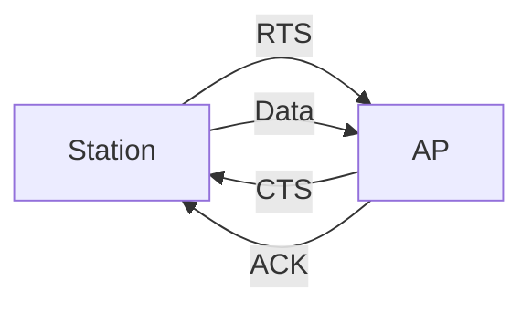
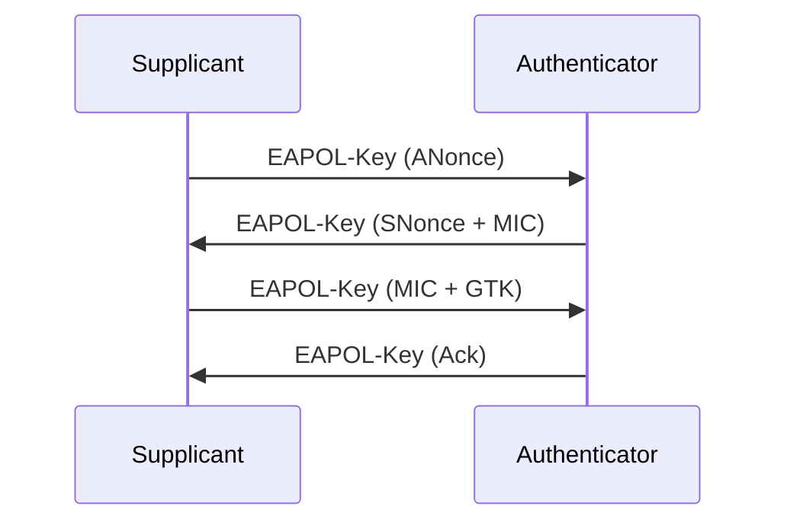
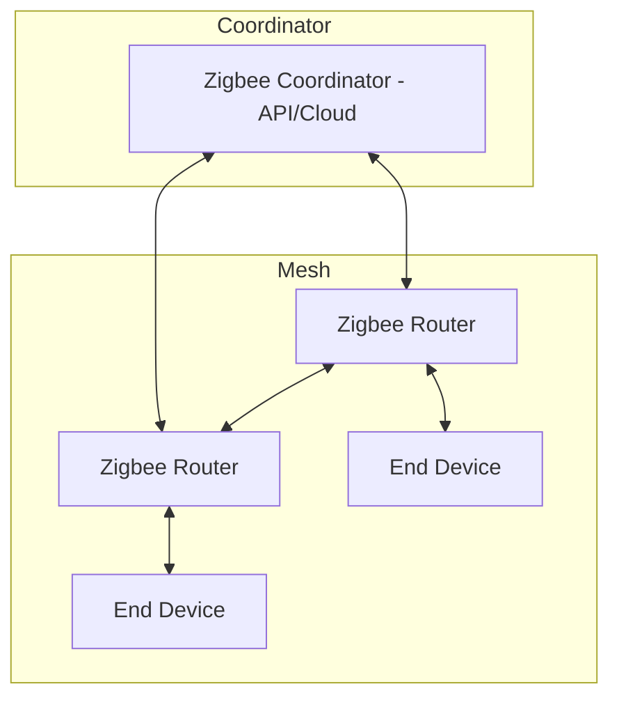
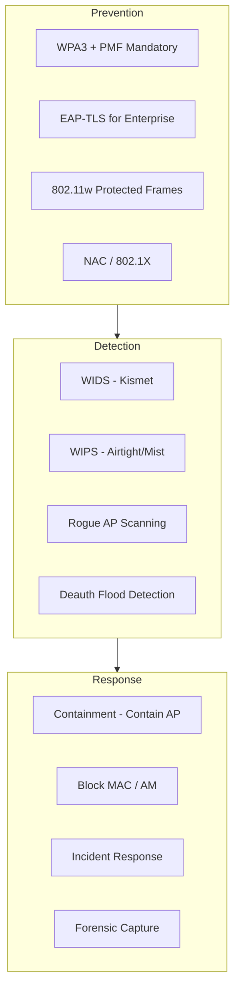

# 📡 Wireless Security Deep Dive — 802.11 / Bluetooth / Zigbee

> *"Wireless is a shared medium by design — every packet is someone else's problem until it's encrypted."*
> — Wireless Security Field Manual

> [!INFO] **Cakupan Note**
> Dokumentasi ini mencakup berbagai aspek keamanan wireless: protokol 802.11 (WiFi), Bluetooth, Zigbee, Z-Wave, Thread, Matter, serta serangan dan mitigasi berbasis SDR. Fokus pada attack vectors real-world, tooling, dan defense strategies untuk pentester dan blue team.

---

## 📋 Daftar Isi

- [[#1. Pendahuluan — Wireless sebagai Attack Surface]]
- [[#2. Fundamental 802.11 — PHY, MAC, dan Frame Types]]
- [[#3. Frame Management, Control, dan Data]]
- [[#4. WPA2 4-Way Handshake — Mekanisme dan Celah]]
- [[#5. PMKID Attack — Tanpa Client Diperlukan]]
- [[#6. KRACK — Key Reinstallation Attack]]
- [[#7. Cracking WPA2 dengan Hashcat]]
- [[#8. WPA3 & SAE — Simultaneous Authentication of Equals]]
- [[#9. Dragonblood Attack — Kerentanan WPA3]]
- [[#10. Deauthentication Attack — Dasar WiFi DoS]]
- [[#11. Evil Twin, Rogue AP, dan Karma Attack]]
- [[#12. Bluetooth Low Energy (BLE) — Serangan dan Mitigasi]]
- [[#13. BlueBorne — Remote Code Execution via Bluetooth]]
- [[#14. KNOB & BIAS — Kelemahan Bluetooth Pairing]]
- [[#15. Zigbee Security — IoT Wireless Protocol]]
- [[#16. Z-Wave, Thread, dan Matter — Perbandingan Keamanan]]
- [[#17. SDR-Based Attacks — HackRF dan USRP]]
- [[#18. Wireless IDS/IPS — Kismet, Wireshark, bettercap]]
- [[#19. Enterprise WiFi — WPA2-Enterprise, PEAP, EAP-TLS]]
- [[#20. Tooling Ecosystem — aircrack-ng sampai BlueZ]]
- [[#21. Defense Strategy — 802.11w, EAP-TLS, Migrasi WPA3]]
- [[#22. Referensi dan Bacaan Lanjutan]]

---

## 1. Pendahuluan — Wireless sebagai Attack Surface

Wireless communication telah menjadi tulang punggung infrastruktur modern — dari WiFi di perkantoran, Bluetooth di perangkat wearable, hingga Zigbee/Z-Wave di smart home. Sayangnya, sifat shared medium dari wireless membuka attack surface yang luas:

| Dimensi | Karakteristik | Implikasi Keamanan |
|---------|--------------|-------------------|
| **Confidentiality** | Semua orang di range RF bisa mendengar | Sniffing, traffic decryption |
| **Integrity** | CRC rentan spoofing | Frame injection, bit-flipping |
| **Availability** | Shared channel rawan interferensi | Deauth, jammer, RF jamming |
| **Authentication** | Association opsional | Rogue AP, Evil Twin, MITM |
| **Privacy** | MAC address visible | Tracking, profiling perangkat |

Wireless security berporos pada tiga pilar: **confidentiality** (enkripsi), **integrity** (MIC/ICV), dan **authentication** (PSK/802.1X). Kegagalan di salah satu pilar membuka celah untuk full compromise.

> [!TIP] **Mindset Pentester**
> Wireless penetration testing berbeda dari network pentest biasa — kamu harus memahami RF physics, protokol layer 2, dan tools SDR. Lihat juga [[hierarchy-osint-rf]] untuk konteks RF lebih luas.

---

## 2. Fundamental 802.11 — PHY, MAC, dan Frame Types

802.11 adalah standar IEEE untuk WLAN. Beroperasi di pita 2.4 GHz, 5 GHz, dan 6 GHz (WiFi 6E). Berikut layer utama:

### 2.1 Physical Layer (PHY)

| Generasi | Standar | Frekuensi | Kecepatan Maks | Modulasi |
|----------|---------|-----------|----------------|----------|
| WiFi 4 | 802.11n | 2.4 / 5 GHz | 600 Mbps | OFDM, MIMO |
| WiFi 5 | 802.11ac | 5 GHz | 3.5 Gbps | OFDM, MU-MIMO |
| WiFi 6 | 802.11ax | 2.4 / 5 GHz | 9.6 Gbps | OFDMA, MU-MIMO |
| WiFi 6E | 802.11ax | +6 GHz | 9.6 Gbps | OFDMA |
| WiFi 7 | 802.11be | 2.4 / 5 / 6 GHz | 46 Gbps | 4096-QAM, CMU-MIMO |

### 2.2 MAC Layer

MAC (Media Access Control) di 802.11 menggunakan **CSMA/CA** (Carrier Sense Multiple Access with Collision Avoidance), bukan CSMA/CD seperti ethernet. Ini karena di RF, mendeteksi collision sulit dilakukan sambil transmit.



**Tiga tipe frame 802.11:**

1. **Management Frames** — association, authentication, beacon, probe, deauth
2. **Control Frames** — RTS, CTS, ACK, PS-Poll
3. **Data Frames** — payload/data traffic

> Kelemahan fundamental: management frames tidak dienkripsi (pra-802.11w), memungkinkan spoofing dan injection.

---

## 3. Frame Management, Control, dan Data

Setiap frame 802.11 memiliki header 30-36 byte yang mencakup:

- **Frame Control** (2B): type, subtype, flags (To DS, From DS, Retry, Power Mgmt)
- **Duration/ID** (2B): NAV reservation
- **Address 1-4** (6B each): DA, SA, BSSID, TA
- **Sequence Control** (2B): fragment & sequence number
- **Frame Body** (0-2304B): data atau IEs (Information Elements)
- **FCS** (4B): CRC32

### 3.1 Management Frames Penting

| Frame Subtype | Fungsi | Celah Keamanan |
|--------------|--------|----------------|
| **Beacon** | AP advertisement, berisi SSID, capabilities, RSN IE | SSID disclosure, fingerprinting AP |
| **Probe Request/Response** | Discovery station-AP | MAC tracking, device profiling |
| **Authentication** | Open System / Shared Key auth | Null auth bisa diforgery |
| **Association Request/Response** | Join BSS | Spoofed association |
| **Deauthentication** | Putuskan koneksi | **TIDAK dienkripsi** — celah DoS klasik |
| **Disassociation** | Lepas asosiasi | Sama seperti deauth, bisa spoof |

### 3.2 Radiotap Header

Untuk packet injection dan monitoring, gunakan **radiotap header** — metadata tambahan sebelum frame 802.11 yang berisi signal strength, channel, noise, dan flags:

```text
Radiotap Header v0
  Header revision: 0
  Header pad: 0
  Length: 26
  Present flags: 0x0000284e
    TSFT, Flags, Rate, Channel, dBm_AntSignal, ...
```

---

## 4. WPA2 4-Way Handshake — Mekanisme dan Celah

WPA2-Personal menggunakan **PBKDF2** untuk derivasi PSK (Pairwise Master Key) dari passphrase + SSID. 4-Way Handshake bertujuan menurunkan PTK (Pairwise Transient Key) tanpa mengekspos PSK langsung.

### 4.1 Mekanisme Handshake



### 4.2 Detail Derivation

```
PMK = PBKDF2(HMAC-SHA1, passphrase, SSID, 4096, 256)
PTK = PRF(PMK, "Pairwise key expansion", Min(AP MAC, STA MAC) || Max(AP MAC, STA MAC) || Min(ANonce, SNonce) || Max(ANonce, SNonce))
```

PTK dibagi menjadi 4 bagian:

- **KCK** (Key Confirmation Key) — 128 bit: MIC
- **KEK** (Key Encryption Key) — 128 bit: enkripsi GTK
- **TK** (Temporal Key) — 128 bit: enkripsi data CCMP/AES
- **MIC** (Message Integrity Code) — opsional

### 4.3 Celah

1. **Passphrase lemah** — dictionary attack offline jika handshake tertangkap
2. **No forward secrecy** — jika PSK bocor, semua traffic masa lalu bisa didekripsi
3. **SSID sebagai salt** — SSID umum (linksys, netgear) mempercepat precomputed rainbow tables

---

## 5. PMKID Attack — Tanpa Client Diperlukan

Ditemukan oleh **Atom (hashcat)** di 2018. PMKID adalah nilai yang dihitung AP saat association dan dikirim di EAPOL-Key message pertama — bahkan tanpa client penuh melakukan handshake.

### 5.1 Cara Kerja

```text
PMKID = HMAC-SHA1(PMK, "PMK Name" | MAC_AP | MAC_STA)
```

AP mengirim PMKID sebagai RSN IE di **EAPOL-Key msg 1**. Kita hanya butuh:
- Satu frame dari AP ke client (atau message 1 saja)
- PMKID di-hash dengan PMK yang sama — jadi bisa di-crack offline

### 5.2 Capture

```bash
# Dengan hcxdumptool
hcxdumptool -i wlan0mon -o capture.pcapng

# Konversi ke format hashcat
hcxpcapngtool -o hash.hc22000 capture.pcapng

# Hash format: WPA*01$PMKID$MAC_AP$MAC_STA$ESSID$*
```

### 5.3 Crack

```bash
hashcat -m 22000 hash.hc22000 wordlist.txt
```

> Kelebihan PMKID dibanding handshake klasik: **tidak perlu menunggu client connect**. Cukup AP mengirim beacon/probe response dengan RSN IE.

[[arp-spoofing-mitigation]] membahas teknik mitigasi layer 2 — tapi untuk wireless, segitiga AP-Client-Attacker berbeda.

---

## 6. KRACK — Key Reinstallation Attack

Ditemukan oleh **Mathy Vanhoef** (2017). KRACK (Key Reinstallation Attack) mengeksploitasi celah di **4-way handshake**: attacker memaksa victim menginstal ulang PTK yang sudah dipakai, mereset nonce dan replay counter.

### 6.1 Mekanisme

Attacker melakukan **reply** pada message 3 dari handshake. Karena client tidak punya mekanisme untuk deteksi bahwa PTK sudah terinstall, client akan menginstall ulang key yang sama — dan **nonce & replay counter di-reset ke 0**.

### 6.2 Dampak

- **Decryption replay** — attacker bisa memutarbalikkan packet yang terenkripsi
- **Decryption** — pada implementasi tertentu (GCMP), attacker bisa mendekripsi packet dengan bit-flipping
- **Forge** — group key bisa diprediksi attacker

### 6.3 Patch

Update semua client dan AP ke implementasi dengan **802.11-2016** yang sudah include fix KRACK:

```text
- Pastikan message 3 dan group handshake punya mekanisme anti-replay
- Nonce tidak boleh di-reset saat key reinstallation
- Implementasi standard wajib track apakah PTK sudah dipakai
```

> [!WARNING] **EOL Perangkat**
> Banyak perangkat IoT masih belum di-patch KRACK. WPA3 secara fundamental tidak bisa kena KRACK karena handshake SAE berbasis FFS (Finite Field Cryptography).

---

## 7. Cracking WPA2 dengan Hashcat

Hashcat adalah tool GPU-accelerated untuk cracking password, mendukung format hash wireless **-m 22000** (PMKID) dan **-m 2500** (WPA2 handshake).

### 7.1 Mode Hash WPA

| Mode | Deskripsi | Sumber |
|------|-----------|--------|
| 22000 | WPA-PBKDF2-PMKID+EAPOL | hcxpcapngtool |
| 2500 | WPA-PBKDF2-PMKID+EAPOL (legacy) | aircrack-ng |
| 22001 | WPA-PMK-PMKID+EAPOL (tanpa PBKDF2) | PMK known |
| 16800 | WPA-PMKID-PBKDF2 | hcxdumptool |

### 7.2 Strategi Cracking

```bash
# Rule-based attack
hashcat -m 22000 hash.hc22000 -a 0 wordlist.txt -r rules/best64.rule

# Mask attack (bruteforce pola)
hashcat -m 22000 hash.hc22000 -a 3 ?u?l?l?l?d?d?d?d

# Kombinator attack
hashcat -m 22000 hash.hc22000 -a 1 wordlist1.txt wordlist2.txt
```

### 7.3 Optimasi

```bash
# Workload profile
hashcat -m 22000 hash.hc22000 -w 4 -O wordlist.txt

# --O = Optimized kernel (short pw mask)
# -w 4 = Desktop full power
# --status-timer=10 = Status setiap 10 detik
```

**Hashcat speeds** untuk WPA2 di GPU modern:

| GPU | Speed (kH/s) |
|----|-------------|
| RTX 4090 | ~380 kH/s |
| RTX 3090 | ~250 kH/s |
| RTX 3080 | ~200 kH/s |
| Apple M1 | ~40 kH/s |

> PBKDF2-SHA1 di 4096 iterasi membuat WPA2 lambat di-crack — tapi tetap lebih cepat dari WPA3 yang pakai SAE dengan iterasi lebih banyak dan FFS operation.

---

## 8. WPA3 & SAE — Simultaneous Authentication of Equals

WPA3 memperkenalkan **SAE** (Simultaneous Authentication of Equals) — protokol authentication berbasis **Dragonfly Key Exchange** (RFC 7664) yang menggunakan **FFC** (Finite Field Cryptography) atau **ECC** (Elliptic Curve).

### 8.1 Perbandingan WPA2 vs WPA3

| Fitur | WPA2 | WPA3 |
|-------|------|------|
| Auth protocol | 4-Way Handshake (PSK) | SAE (Dragonfly) |
| Forward secrecy | Tidak | **Ya** (DHE) |
| Brute-force offline | Dictionary attack | Hash iterasi tinggi |
| Protected Mgmt Frames | Opsional | **Wajib** |
| Easy Connect | Tidak | Wi-Fi Easy Connect (DPP) |
| Ciphers | CCMP (AES) | GCMP-256, CMAC-256 |

### 8.2 SAE Handshake

```text
1. Commit: Masing-masing pihak mengirim commitment (scalar + element)
2. Confirm: Verifikasi bahwa commit legitimate
3. PTK derivation: Turunkan PMK dari shared secret
```

SAE menggunakan **hunting-and-pecking** method — iterasi bertahap untuk menemukan titik di kurva eliptik yang valid.

### 8.3 Kelebihan

- **Perfect Forward Secrecy** — walau password bocor, traffic masa lalu tetap aman
- **Offline brute-force sulit** — password tidak langsung di-hash, tapi melalui exponentiation
- **Anti-clogging** — mekanisme token untuk mencegah resource exhaustion DoS

---

## 9. Dragonblood Attack — Kerentanan WPA3

Dragonblood (Vanhoef & Ronen, 2019) adalah kumpulan kerentanan di implementasi WPA3/SAE:

### 9.1 Side-Channel Attack

Password character bisa ditebak satu-per-satu dengan timing side-channel pada implementasi **hunting-and-pecking**.

```python
# Pseudocode: timing leak di hunting-and-pecking
def hunting_and_peck(ssid, password):
    i = 0
    while True:
        candidate = H(ssid || password || i)
        if is_valid_point(candidate):
            return candidate  # Timing tergantung jumlah iterasi!
        i += 1
```

Setiap karakter password yang benar mengubah jumlah iterasi — cukup untuk melakukan **password partitioning oracle**.

### 9.2 Downgrade Attack

Attacker memaksa AP/Client untuk downgrade ke WPA2 dengan menghilangkan RSNE yang menandakan dukungan WPA3.

### 9.3 Cache-Based Attack

Beberapa implementasi SAE menyimpan password di cache tanpa timing protection — attacker lokal bisa leak password via L1/L2 cache timing.

### 9.4 Mitigasi

- Gunakan **constant-time implementation** untuk FFC/ECC operations
- Implementasi **random delay** untuk hunting-and-pecking
- **Disable WPA2 transitional mode** jika semua perangkat support WPA3

---

## 10. Deauthentication Attack — Dasar WiFi DoS

Deauth attack adalah serangan paling dasar dan paling efektif di WiFi. Karena **management frames tidak dienkripsi** (sebelum 802.11w), attacker bisa memalsukan frame deauth dari AP ke client.

### 10.1 Teknik

```bash
# Deauth spesifik client dari AP tertentu
aireplay-ng -0 5 -a <AP_MAC> -c <CLIENT_MAC> wlan0mon

# Deauth broadcast — kick semua client
aireplay-ng -0 5 -a <AP_MAC> wlan0mon

# mdk4 — deauth lebih aggresif
mdk4 wlan0mon d -B <AP_MAC> -c <CHANNEL>
```

### 10.2 Use Case

1. **Force handshake capture** — kick client, dia reconnect otomatis, tangkap 4-way handshake
2. **DoS AP** — kick semua client terus-menerus (AP jadi useless)
3. **Evil Twin trigger** — client disconnect, lalu otomatis connect ke Evil Twin dengan signal lebih kuat
4. **WPA3 SAE attack** — trigger SAE handshake ulang untuk capture commit frames

### 10.3 Deteksi

Kismet dan Wireshark bisa mendeteksi deauth flood:

```bash
# Wireshark filter
wlan.fc.type_subtype == 0x0c
```

Rate-limit deauth > 10/detik dari satu AP biasanya indikasi serangan.

---

## 11. Evil Twin, Rogue AP, dan Karma Attack

### 11.1 Evil Twin

Evil Twin adalah AP palsu yang meniru SSID, BSSID, dan channel AP legitimate. Tujuannya **MITM**: traffic victim melewati attacker.

```bash
# Contoh dengan bettercap
set wifi.ap.ssid FreeWiFi
set wifi.ap.channel 6
wifi.ap

# Atau dengan airbase-ng
airbase-ng -e "FreeWiFi" -c 6 wlan0mon
```

**Alur serangan:**
1. Attacker deploy AP dengan SSID yang sama
2. Signal strength dibuat lebih kuat dari AP asli
3. Victim otomatis pindah (atau di-deauth dari AP asli)
4. Traffic victim lewat attacker — bisa capture credential, inject payload

### 11.2 Rogue AP

Rogue AP adalah AP ilegal yang dipasang di jaringan perusahaan — biasanya oleh karyawan yang nggak sengaja pasang AP sendiri. Bahaya:

- Bypass firewall perusahaan
- Membuka backdoor ke internal network
- Menyediakan entry point untuk attacker luar

### 11.3 Karma Attack

Karma mengeksploitasi **Probe Request** dari client. Client mengirim probe dengan SSID yang pernah mereka connect — attacker menjawab dengan emulasi AP:

```bash
# bettercap karma mode
set wifi.ap.ssid ""  # kosong = karma otomatis
set wifi.handshakes.file /path/to/wordlist
wifi.recon on
wifi.ap
```

**Deteksi:**
- Cari AP dengan BSSID tidak dikenal tapi SSID legitimate
- Signal strength tiba-tiba tinggi untuk AP "baru"
- Kismet bisa flag "SSID Cloning" atau "Karma Attack"

[[web-hacking-exploitation]] membahas post-exploitation setelah mendapat foothold via Evil Twin.

---

## 12. Bluetooth Low Energy (BLE) — Serangan dan Mitigasi

BLE (Bluetooth 4.0+) adalah standar komunikasi low-power untuk IoT, wearable, dan beacon. Security model BLE punya beberapa kelemahan:

### 12.1 Pairing Methods

| Method | Keamanan | Kerentanan |
|--------|----------|------------|
| Just Works | Rendah | No MITM protection |
| Passkey Entry | Sedang | PIN 6 digit bisa bruteforce |
| Numeric Comparison | Tinggi | Aman jika user verify |
| OOB (NFC) | Tinggi | Tergantung implementasi |

### 12.2 BLE Sniffing

```bash
# Dengan BlueZ + btmon
btmon -w capture.log
hcitool lescan  # Scan BLE devices

# Atau dengan nRF Sniffer + Wireshark
# firmware:nrf51/nrf52 -> serial -> Wireshark ext cap
```

### 12.3 Serangan BLE

1. **MAC Address Tracking** — BLE advertising packet mengandung MAC address tetap
2. **Connection Spoofing** — re-connect tanpa pairing jika bonding info dicuri
3. **LLDoS** (Link Layer DoS) — flood connection request
4. **MITM di Pairing** — Just Works dan Passkey Entry rentan

### 12.4 Defenses

- Gunakan **LE Secure Connections** (Bluetooth 4.2+) dengan ECDH
- Aktifkan **Privacy Mode** (resolvable private address)
- Perangkat BLE sebaiknya pakai **numeric comparison** atau **OOB**

---

## 13. BlueBorne — Remote Code Execution via Bluetooth

BlueBorne (Armis, 2017) adalah kumpulan 8 zero-day vulnerabilities di Bluetooth, memungkinkan **RCE tanpa pairing** dan tanpa interaksi user.

### 13.1 CVE yang Terkena

| CVE | Tipe | Dampak |
|-----|------|--------|
| CVE-2017-0781 | Android RCE | Remote code execution di Android |
| CVE-2017-0782 | Android Info Leak | Memory leak |
| CVE-2017-8628 | Windows RCE | RCE via Bluetooth stack |
| CVE-2017-1000251 | Linux RCE | Stack buffer overflow di L2CAP |
| CVE-2017-14315 | iOS RCE | Heap overflow di Apple BT stack |

### 13.2 Mekanisme

BlueBorne mengeksploitasi **buffer overflow** di Bluetooth stack. Dengan mengirim packet SDP (Service Discovery Protocol) atau L2CAP yang dimanipulasi, attacker bisa:

1. Mendapatkan remote shell
2. Keylogger, screen capture
3. Data exfiltration lewat Bluetooth
4. Spread ke perangkat lain — wormable

### 13.3 Mitigasi

- **Patch Bluetooth stack** — patch release di 2017-2018 (Android 8+, iOS 10+, Windows 10)
- **Disable Bluetooth** jika tidak diperlukan
- **Update firmware** perangkat IoT yang support Bluetooth
- Segmentasi jaringan — Bluetooth terpisah dari produksi

> [!CAUTION] **BlueBorne di IoT**
> Puluhan juta perangkat IoT masih belum di-patch BlueBorne. Karena RCE-nya **pre-pairing**, tidak ada perlindungan dari user side.

---

## 14. KNOB & BIAS — Kelemahan Bluetooth Pairing

### 14.1 KNOB (Key Negotiation Of Bluetooth)

KNOB (CVE-2019-9506) — ditemukan Vanhoef (2019). Menyerang **BR/EDR** pairing: attacker memaksa negosiasi entropy key menjadi **1 byte** (minimal 7 bytes normal).

```text
Normal: 16 bytes random entropy
KNOB: 1 byte (hanya 256 kemungkinan)
```

Dampak: encryption key bisa di-bruteforce. Attacker cukup dengar beberapa packet dan brute-force 256 variasi.

**Mitigasi:**
- Bluetooth 5.1+ mewajibkan minimum **7 bytes** entropy
- Implementasi wajib tolak negosiasi < 7 bytes

### 14.2 BIAS (Bluetooth Impersonation Attack)

BIAS (2020) menyerang **authentication phase** pairing BR/EDR. Spesifikasi Bluetooth mengizinkan link key 0 (secure connection) atau legacy key — attacker memaksa legacy auth, lalu memalsukan identity perangkat.

```text
1. Attacker connect victim dengan Bluetooth address legitimate
2. Forced downgrade ke legacy authentication
3. SRES (Signed Response) bisa diprediksi
4. Attacker berhasil impersonate perangkat legitimate
```

**Dampak:** Attacker bisa sepenuhnya impersonate keyboard, mouse, headset, atau smartphone via Bluetooth.

**Mitigasi:**
- Update perangkat yang support Bluetooth Core Spec 5.2+ (fix di spesifikasi)
- Pastikan implementasi check **compare SRES** di kedua arah

---

## 15. Zigbee Security — IoT Wireless Protocol

Zigbee adalah protokol mesh berbasis **IEEE 802.15.4**, digunakan di smart home (Philips Hue, IKEA Trådfri, Xiaomi). Beroperasi di 2.4 GHz, 915 MHz (US), 868 MHz (EU).

### 15.1 Arsitektur



### 15.2 Security Layers

| Layer | Mekanisme | Celah |
|-------|-----------|-------|
| **Network Layer** | NWK Key (AES-128-CCM*) | Jika NWK key bocor, semua traffic terbaca |
| **Application Layer** | APS Link Key (per-device) | Trust Center Link Key default diketahui |
| **Install Code** | Pre-configured key out-of-band | ZLL (Zigbee Light Link) — master key publik |

### 15.3 Serangan Zigbee

1. **Network Key Extraction** — menggunakan **ZLL (Zigbee Light Link) key** yang publik: `ZigBeeAlliance09`
2. **Replay Attack** — capture dan replay command (on/off lampu, unlock door)
3. **TouchLink Attack** — pada ZLL, pairing dilakukan via NFC/Touch — attacker bisa inject command saat pairing
4. **Sniffer Attack** — dengan **CC2531** + **Zigbee2MQTT** atau **Killerbee**

```bash
# Sniffing Zigbee dengan Killerbee
# install killerbee toolkit
zbid.py
zbreplay  # replay captured packet
zbdsniff  # dump network key dari capture
```

### 15.4 Mitigasi

- Gunakan **Zigbee 3.0** (mandatory install code, wajib APS encryption)
- **Install code** yang unik (bukan default)
- **Network key rotation** periodik
- Update firmware perangkat Zigbee

---

## 16. Z-Wave, Thread, dan Matter — Perbandingan Keamanan

### 16.1 Z-Wave

Z-Wave adalah protokol propietary oleh Z-Wave Alliance. Beroperasi di sub-1 GHz (908/868 MHz), lebih sedikit interferensi daripada 2.4 GHz.

| Fitur | Value |
|-------|-------|
| Frekuensi | 800-900 MHz |
| Range | ~30m indoor |
| Topologi | Mesh |
| Enkripsi | AES-128 (S2 security) |
| Pairing | DSK (Device Specific Key) |

**Celah Z-Wave:**
- **Z-Wave S0** — legacy security, key bisa didapat
- **Z-Wave downgrade attack** — paksa device pakai S0 atau non-secure mode
- **Hardware key injection** — programmer bisa inject node ID dan home ID ke device Z-Wave

### 16.2 Thread

Thread adalah protokol mesh berbasis **IPv6**, menggunakan **6LoWPAN**. Dirancang oleh Thread Group, diadopsi Apple, Google, Samsung.

- **Security by design**: DTLS (Datagram TLS) setiap komunikasi
- **Commissioning**: PKI-based, setiap device punya certificate
- **Celah utama**: supply chain attack (compromised device certificate)

### 16.3 Matter

Matter (Project CHIP) adalah standar interoperability baru oleh CSA (Connectivity Standards Alliance). Berjalan di atas Thread, WiFi, atau Ethernet.

| Fitur | Detail |
|-------|--------|
| Enkripsi | TLS 1.3 + AEAD (AES-CCM) |
| Auth | Certificate-based (PKI) |
| Device commissioning | QR code + passcode |
| Secure boot | Wajib |
| Software update | OTA mandatory |

**Keunggulan Matter:**
- Setiap device punya **device attestation certificate (DAC)**
- **No master key** — setiap sesi punya kunci sendiri
- **Forward secrecy** — ECDHE key exchange
- **Update mechanism** mandatory, patch celah via firmware

---

## 17. SDR-Based Attacks — HackRF dan USRP

Software-Defined Radio (SDR) memungkinkan transmisi dan penerimaan RF dengan fleksibilitas penuh — dari 1 MHz sampai 6 GHz (HackRF One).

### 17.1 Hardware

| Device | Bandwidth | Frekuensi | Biaya |
|--------|-----------|-----------|-------|
| RTL-SDR | 3.2 MHz | 24-1700 MHz | ~$25 |
| HackRF One | 20 MHz | 1 MHz-6 GHz | ~$300 |
| USRP B210 | 56 MHz | 70 MHz-6 GHz | ~$1,200 |
| LimeSDR | 28 MHz | 100 kHz-3.8 GHz | ~$300 |
| BladeRF 2.0 | 56 MHz | 47 MHz-6 GHz | ~$650 |

### 17.2 Tooling

```bash
# GNU Radio — block diagram SDR
# gr-osmosdr — source/sink hardware abstraction

# Capture WiFi dengan HackRF
hackrf_transfer -r raw.iq -f 2.412e6 -s 20000000

# Replay sinyal keyless car (rolling-jam attack)
# capture dulu
hackrf_transfer -r car_key.iq -f 315e6 -s 2000000 -l 40 -g 20
# lalu replay
hackrf_transfer -t car_key.iq -f 315e6 -s 2000000 -x 40
```

### 17.3 Serangan dengan SDR

| Serangan | Deskripsi | Tool |
|----------|-----------|------|
| **Replay Attack** | Capture & replay RF signal | HackRF, GNU Radio |
| **Rolling Jam** | Blokir rolling code, capture & replay | RFCrack, Yard Stick One |
| **ADS-B Spoof** | Fake aircraft position | dump1090, bladeRF |
| **GPS Spoof** | Fake GPS position | GPS-SDR-SIM, HackRF |
| **GSM Decryption** | IMSI catcher | gr-gsm, USRP |
| **Keyless Car Attack** | Amplify relay, capture key fob | Proxmark3, HackRF |

### 17.4 Signal Analysis

```bash
# Spektrum analyzer di CLI
rtl_power -f 2400M:2500M:1M power.csv
gnuplot -e "plot 'power.csv'"  # visualisasi

# Demodulasi FM dengan rtl_fm
rtl_fm -f 100.5e6 -M wbfm -s 200000 | aplay -r 48000
```

> [!WARNING] **Legal Boundaries**
> Transmisi RF ilegal di banyak yurisdiksi tanpa lisensi FCC/CEPT. SDR untuk **receive only** umumnya aman. Jangan transmit di band ISM tanpa otorisasi.

---

## 18. Wireless IDS/IPS — Kismet, Wireshark, bettercap

### 18.1 Kismet

Kismet adalah wireless intrusion detection system (WIDS) yang mendeteksi lebih dari jenis AP.

```bash
# Setup Kismet
kismet -c wlan0mon
```

**Deteksi Kismet:**

| Event | Tanda |
|-------|-------|
| Deauth Flood | >100 deauth/detik dari 1 source |
| SSID Cloning | Banyak AP dengan SSID sama, BSSID beda |
| Probe SSID | Client probe ke SSID non-eksis |
| WiFi Jamming | Seluruh channel noise tinggi |
| Karma Attack | AP jawab semua probe request |
| EAPOL flood | Rate-limite AP terhadap handshake |

### 18.2 Wireshark — Wireless Filtering

```bash
# Wireshark filter untuk wireless analysis
wlan.fc.type_subtype == 0x08  # Beacon frames
wlan.fc.type_subtype == 0x0c  # Deauth
eapol                              # 4-Way Handshake
wlan.fc.type == 0                 # Management frames
wlan.fc.type == 2                 # Data frames
wlan.fc.protected == 1            # Encrypted frames
```

**Wireshark untuk wireless forensic:**
- **IO Graph** — visualisasi traffic spike (deauth, beacon flood)
- **Expert Info** — Warnings & errors di capture
- **Follow TCP Stream** — decrypt traffic jika key diketahui

### 18.3 bettercap

Bettercap adalah tool all-in-one untuk network attack & monitoring, termasuk WiFi.

```bash
# WiFi reconnaissance
sudo bettercap -eval "set wifi.interface wlan0; wifi.recon on"

# Deauth detection
set wifi.show.ap.deauth true

# Captive portal (Evil Twin)
set httpd.path /path/to/captive
httpd
dns.spoof on
```

**Module bettercap WiFi:**
- `wifi.ap` — access point mode
- `wifi.deauth` — deauth specific BSSID
- `wifi.handshakes` — capture PMKID
- `ble.recon` — BLE device scanning
- `ble.enum` — BLE service enumeration

---

## 19. Enterprise WiFi — WPA2-Enterprise, PEAP, EAP-TLS

Enterprise WiFi menggunakan **802.1X / RADIUS** untuk authentication, bukan PSK.

### 19.1 EAP Methods

| Method | Auth | Keamanan | Celah |
|--------|------|----------|-------|
| **EAP-TLS** | Certificate (mutual) | Tinggi — PKI-based | Management (cert distribution) |
| **PEAP** | Password (MSCHAPv2) | Sedang — tunneled | Cracking MSCHAPv2 offline |
| **EAP-TTLS** | Password/PAP/CHAP | Sedang | Tunnel doang, inner auth lemah |
| **LEAP** | MSCHAPv2 modified | **Rendah** | asleap bisa crack |

### 19.2 Attack pada WPA2-Enterprise

```bash
# Hostapd-WPE — fake AP untuk capture credential
# install hostapd-wpe
hostapd-wpe /etc/hostapd-wpe/hostapd-wpe.conf

# Captured credential dalam format:
# username:challenge:response
# Bisa di-crack dengan asleap
asleap -r capture.txt -W wordlist.txt
```

### 19.3 Celah PEAP

1. **No certificate validation** — banyak client (terutama enterprise) tidak validate server cert
2. **MSCHAPv2 weak** — challenge-response bisa di-crack offline: `DES(DES(DES(0, hash[0:7]), hash[7:14]), hash[14:21])`
3. **EAP downgrade** — attacker paksa negosiasi EAP method ke yang weakest

### 19.4 EAP-TLS — Gold Standard

```python
# EAP-TLS mutual authentication flow
1. Client → Server: EAP-Response/Identity
2. Server → Client: EAP-Request/EAP-TLS (ServerHello + Cert + CertRequest)
3. Client → Server: EAP-Response/EAP-TLS (ClientCert + ClientKeyExchange + CertVerify)
4. Server → Client: EAP-Request/EAP-TLS (Finished)
5. Client → Server: EAP-Response/EAP-TLS (Finished)
6. Server → Client: EAP-Success
```

EAP-TLS aman karena **mutual certificate-based authentication**. Celah hanya di implementasi:

- Certificate validation tidak di-skip
- Private key jangan bocor
- CRL/OCSP mandatory

---

## 20. Tooling Ecosystem — aircrack-ng sampai BlueZ

### 20.1 Wireless Audit Tools

| Tool | Fungsi | Paket |
|------|--------|-------|
| **aircrack-ng** | WEP/WPA cracking | aircrack-ng |
| **airodump-ng** | WiFi packet capture | aircrack-ng |
| **aireplay-ng** | Frame injection, deauth | aircrack-ng |
| **airbase-ng** | Fake AP | aircrack-ng |
| **airmon-ng** | Interface management | aircrack-ng |
| **hcxdumptool** | PMKID capture | hcxtools |
| **hcxpcapngtool** | Convert pcapng ke hash | hcxtools |
| **hashcat** | GPU cracking | hashcat |
| **bettercap** | All-in-one MITM/WiFi | bettercap |
| **Wifite** | Automated WiFi audit | wifite |
| **Kismet** | WIDS | kismet |
| **mdk4** | WiFi DoS/Stress test | mdk4 |
| **reaver** | WPS PIN brute | reaver |
| **bully** | WPS brute (alternative) | bully |
| **hostapd-wpe** | Rogue AP + credential capture | hostapd-wpe |

### 20.2 Bluetooth Tools

| Tool | Fungsi |
|------|--------|
| **BlueZ** | Official Linux Bluetooth stack |
| **bluetoothctl** | Bluetooth management CLI |
| **btmon** | Bluetooth packet monitor |
| **hcitool** | Classic BT inquiry & connection |
| **gatttool** | BLE GATT read/write |
| **bettercap (BLE)** | BLE recon, spoofing |
| **nRF Sniffer** | BLE capture + Wireshark |
| **BlueBorne PoC** | Scanner untuk BlueBorne |

### 20.3 Zigbee / IoT Tools

| Tool | Fungsi |
|------|--------|
| **Killerbee** | Zigbee/802.15.4 attack toolkit |
| **Zigbee2MQTT** | Zigbee bridge to MQTT |
| **CC2531** | Sniffer dongle + ZBOSS |
| **nRF24L01** | 2.4 GHz sniffer (BT, Zigbee) |
| **Proxmark3** | RFID, iClass, MiFare, keyless entry |
| **RFCrack** | Rolling code attack toolkit |

### 20.4 SDR Tools

| Tool | Fungsi |
|------|--------|
| **GNU Radio** | SDR framework (block diagram) |
| **gr-osmosdr** | RTL-SDR / HackRF / USRP API |
| **rtl_433** | 433 MHz weather sensor decode |
| **dump1090** | ADS-B decoder |
| **GPS-SDR-SIM** | GPS signal generator |
| **Yard Stick One** | Sub-1 GHz transceiver |
| **Ubertooth One** | BT/BLE hardware |

---

## 21. Defense Strategy — 802.11w, EAP-TLS, Migrasi WPA3

### 21.1 802.11w — Protected Management Frames (PMF)

802.11w meng-add **Robust Management Frame Protection** — management frames tertentu dienkripsi:

- **Deauthentication** — terproteksi, tidak bisa spoof
- **Disassociation** — terproteksi
- **Action frames** — terproteksi

```bash
# Enable PMF di hostapd (AP side)
wpa_key_mgmt=WPA-PSK-SHA256
ieee80211w=2  # 0=disable, 1=optional, 2=mandatory

# Client side (wpa_supplicant)
ieee80211w=2
```

### 21.2 EAP-TLS Migration

Enterprise sebaiknya migrasi dari PEAP/MSCHAPv2 ke EAP-TLS:

| Langkah | Detail |
|---------|--------|
| **Setup PKI** | Root CA, intermediate CA, server certs |
| **Deploy Device Cert** | MDM (Jamf/Intune) distribute cert ke device |
| **RADIUS config** | Freeradius / NPS — validasi cert |
| **Disable PEAP** | Setelah semua device migrasi |
| **CRL/OCSP** | Revocation checking |

### 21.3 WPA3 Migration Plan

```text
1. Audit hardware — mana yang support WPA3?
   - WiFi 6 AP (802.11ax) → support
   - WiFi 5 AP (802.11ac) → firmware upgrade maybe
   - Client WiFi 5+ → support SAE

2. Enable mixed mode (WPA2/WPA3 transitional)
   - AP announce both RSNE
   - Client auto-pilih yang terbaik
   - WARNING: Downgrade attack possible!

3. Pastikan semua device support:
   - Check client firmware
   - Update driver WiFi

4. Full WPA3 — disable WPA2 transitional
   - WPA3-Only mode
   - PMF mandatory
   - GCMP-256 cipher
```

### 21.4 Defense-in-Depth Wireless



### 21.5 Checklist Keamanan Wireless

- [ ] WPA3 atau WPA2 dengan PMF **mandatory**
- [ ] SSID tidak menggunakan informasi sensitif
- [ ] Guest network terisolasi dari internal
- [ ] **Disable WPS** (jika masih WPA2)
- [ ] Enable **MAC whitelist** (untuk controlled environment)
- [ ] Implementasi **802.1X** untuk enterprise
- [ ] **Rogue AP detection** — Kismet atau AP controller hardware
- [ ] **Periodic wireless survey** — spectrum analysis
- [ ] **Firmware update** rutin untuk AP dan client
- [ ] **Disable unnecessary protocols** — Bluetooth, WiFi Direct jika tidak dipakai
- [ ] **WiFi 6 upgrade** — OFDMA dan BSS coloring mengurangi collision
- [ ] **Training user** — jangan sembarangan connect WiFi publik

---

## 22. Referensi dan Bacaan Lanjutan

### Academic Papers

1. **Vanhoef, M., & Piessens, F. (2017).** *Key Reinstallation Attacks: Forcing Nonce Reuse in WPA2.* — KRACK founding paper
2. **Vanhoef, M., & Ronen, E. (2019).** *Dragonblood: Analyzing the Dragonfly Handshake of WPA3 and EAP-pwd.* — WPA3 vulnerability
3. **Armis Lab (2017).** *BlueBorne: The Bluetooth Attack Vector that Spreads Like a Parasite.*
4. **Vanhoef, M., et al. (2019).** *KNOB: Key Negotiation of Bluetooth Attack.*
5. **Vanhoef, M., et al. (2020).** *BIAS: Bluetooth Impersonation AttackS.*

### Books

| Judul | Penulis | Fokus |
|-------|---------|-------|
| *WiFi Security: Wireless Hacking with Kali Linux* | Vivek Ramachandran | WiFi pentest |
| *The Hacker Playbook 3* | Peter Kim | Wireless attack workflow |
| *BlueHat Red Team* | T. W., A. K. | Red team wireless |
| *RF Hacking: SDR for Pentesters* | Mike Ryan | SDR + wireless |
| *802.11 Wireless Networks: The Definitive Guide* | Matthew Gast | 802.11 protocol |

### Wiki-Links Terkait

- [[military-sigint-deepdive]] — konteks SIGINT lebih luas (RF interception, direction finding)
- [[web-hacking-exploitation]] — post-exploitation via Evil Twin / Rogue AP
- [[arp-spoofing-mitigation]] — layer-2 attack defense tanpa wireless
- [[hierarchy-osint-rf]] — OSINT untuk RF signal, SDR, dan spectrum analysis

### Repositori & Tools

| Nama | URL |
|------|-----|
| aircrack-ng | https://www.aircrack-ng.org |
| hashcat | https://hashcat.net |
| bettercap | https://www.bettercap.org |
| Kismet | https://www.kismetwireless.net |
| Killerbee | https://github.com/riverloopsec/killerbee |
| hcxtools | https://github.com/ZerBea/hcxtools |

---

> [!NOTE] **Catatan Update**
> Dokumentasi ini diupdate per **Juli 2026**. Teknologi wireless terus berkembang — verifikasi terhadap standar terbaru jika digunakan untuk security assessment produksi. WPA3-2024 sudah mulai diadopsi, check update dari WiFi Alliance.

---
