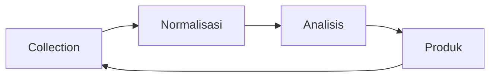

> [!abstract] Definisi
> Workstation analis intelijen modern adalah pipeline tools open-source yang merangkai collection → normalisasi → analisis → produk. Vault ini sudah punya banyak dokumen tools spesifik (Shodan, Maltego, OSINT index) — dokumen ini merangkai semuanya menjadi *satu alur kerja analis*, lengkap dengan pemilihan tools per fase, struktur direktori, dan prinsip keamanan operasional.

---

## 📑 Daftar Isi

1. [[#1. Arsitektur Workstation Analis]]
2. [[#2. Fase 1 — Collection]]
3. [[#3. Fase 2 — Normalisasi]]
4. [[#4. Fase 3 — Analisis & Correlation]]
5. [[#5. Fase 4 — Produk & Reporting]]
6. [[#6. Struktur Direktori & Organisasi]]
7. [[#7. Keamanan Operasional (OPSEC)]]
8. [[#8. Kolaborasi & Sharing Intel]]
9. [[#9. Otomasi & Scripting]]
10. [[#10. Studi Kasus: Investigasi End-to-End]]
11. [[#Referensi & Cross-link]]

---

## 1. Arsitektur Workstation Analis

Workstation analis = pipeline 4 fase. Tools dipilih per fase; satu tools bisa muncul di beberapa fase.



| Fase | Tujuan | Tools Utama |
|---|---|---|
| Collection | Mengumpulkan data mentah | Shodan, Maltego, OSINT feeds, capture |
| Normalisasi | Membersihkan, dedupe, timestamp | Python, pandas, jq, Obsidian |
| Analisis | Menghubungkan, menilai, memproyeksikan | Neo4j, Gephi, Jupyter, AHC matrix |
| Produk | Mengemas hasil untuk keputusan | Markdown, MISP, report template |

> [!important]
> Kebanyakan "wannabe analyst" berhenti di fase Collection — mengumpulkan tanpa menganalisis. Nilai sesungguhnya ada di fase Analisis dan Produk.

---

## 2. Fase 1 — Collection

Mengumpulkan data dari semua disiplin (lihat [[intelligence-reporting-sources-and-tradecraft]] untuk detail INT).

**Tools OSINT:**

| Tools | Fungsi | Kapan Dipakai |
|---|---|---|
| Shodan | Perangkat terhubung internet | Recon target infra |
| Maltego | Graph link analysis | Pemetaan relasi |
| Google Dorks | Operator pencarian lanjut | Discovery dokumen |
| Wayback Machine | Snapshot historis | Konten terhapus |
| SpiderFoot | OSINT automation | Auto-recon |
| theHarvester | Email/domain discovery | Enumerasi |
| Amass | Subdomain enum | Surface expansion |
| Bellingcat toolkit | Multi-source lookup | Investigasi cepat |

> [!tip] Collection checklist
> 1. Definisikan target & scope sebelum mengumpulkan.
> 2. Simpan bukti mentah (screenshot, JSON, HTML) — jangan cuma catatan.
> 3. Catat timestamp & sumber untuk setiap item.
> 4. Jangan over-collect — kumpulkan sesuai requirement (intelligence cycle fase Direction).

**Sumber data & API per disiplin:**

| Disiplin | Sumber / API | Catatan |
|---|---|---|
| OSINT pasif | Shodan API, Censys, FOFA | Perangkat terhubung |
| DNS | SecurityTrails, passive DNS, VirusTotal | Riwayat DNS |
| Dokumen | Google Dorks, Wayback CDX API | Konten historis |
| Breach data | HaveIBeenPwned API, DeHashed | (Etis: verifikasi sendiri) |
| Sosial | Twitter API (paid), OSINT tools | Profil & aktivitas |
| SIGINT (legal) | Open freq databases, radioreference | Frekuensi publik |
| GEOINT | Sentinel Hub, Google Earth Engine | Citra satelit open |

> [!warning]
> Beberapa API (Twitter/X) kini berbayar dan membatasi akses. Selalu cek rate limit & ToS sebelum integrasi ke pipeline.

---

## 3. Fase 2 — Normalisasi

Data mentah berantakan — perlu dibersihkan sebelum analisis.

| Problem | Tools | Teknik |
|---|---|---|
| Format beda-beda | Python, jq | Parse ke JSON/CSV seragam |
| Duplikasi | pandas | Dedupe by key (IP, email, domain) |
| Tanpa timestamp | Python | Standarisasi UTC |
| Noise | regex, grep | Filter keyword, hapus boilerplate |
| IP/domain enrichment | whois, shodan CLI | Tambah konteks (ASN, geo, registrant) |

```python
# Contoh normalisasi sederhana
import pandas as pd
from datetime import datetime, timezone

df = pd.read_csv("raw_observations.csv")
df["ts"] = pd.to_datetime(df["ts"], utc=True)      # standarisasi UTC
df = df.drop_duplicates(subset=["ip", "domain"])   # dedupe
df.to_json("normalized.json", orient="records", date_format="iso")
```

> [!info]
> Obsidian (vault ini) adalah home untuk *catatan analisis* — bukan data mentah. Data mentah di folder `data/raw/`, catatan analisis di `data/notes/`.

---

## 4. Fase 3 — Analisis & Correlation

Ini fase paling bernilai — menghubungkan data menjadi insight.

| Teknik | Tools | Contoh |
|---|---|---|
| Graph analysis | Neo4j, Gephi | Hubungan IP ↔ domain ↔ email ↔ orang |
| Timeline analysis | TimelineJS, Python | Urutan kejadian serangan |
| Geospatial | QGIS | Peta lokasi C2, geo-tag |
| Text mining | spaCy, NLTK | Ekstrak entitas dari laporan |
| Statistical | Jupyter, pandas | Pattern detection, clustering |
| AHC matrix | Spreadsheet | Analisis hipotesis saingan (lihat tradecraft) |

> [!danger] Bias check
> Sebelum menyimpulkan, jalankan checklist bias (confirmation, anchoring, groupthink, mirror-imaging) dari [[intelligence-reporting-sources-and-tradecraft]] section 7. Kesimpulan yang bagus menyebutkan *bukti yang bisa mengubahnya*.

### Teknik analisis terstruktur lanjutan

| Teknik | Deskripsi | Tools |
|---|---|---|
| **Link analysis** | Petakan relasi entity (IP, domain, email, orang) | Neo4j, Maltego |
| **Temporal analysis** | Urutkan kejadian, cari gap & pola | TimelineJS, pandas |
| **Geospatial overlay** | Tumpuk data di peta untuk pola spasial | QGIS, Kepler.gl |
| **Network clustering** | Deteksi komunitas dalam graph | Gephi (Louvain) |
| **Entity resolution** | Identifikasi entity sama di sumber beda | Maltego transform, record linkage |
| **Hypothesis testing** | Uji hipotesis dengan data (A/B mental) | Jupyter, scipy |

**Contoh query Neo4j untuk link analysis:**

```cypher
// Cari semua domain & email yang terhubung ke satu IP
MATCH (ip:IP {value: '203.0.113.5'})-[r]-(n)
RETURN ip, type(r), n
```

> Analisis terbaik menggabungkan **beberapa teknik** — graph untuk struktur, timeline untuk urutan, peta untuk lokasi. Satu teknik saja selalu punya blind spot.

---

## 5. Fase 4 — Produk & Reporting

Output analis bukan dump data — produk yang siap keputusan.

| Produk | Format | Isi |
|---|---|---|
| Intelligence Report | Markdown/PDF | Fakta + source reliability + confidence |
| Timeline Brief | TimelineJS/HTML | Urutan + gap |
| Graph Report | SVG/PNG + narasi | Relasi + penilaian |
| Alert | Singkat | "Sesuatu terjadi + rekomendasi" |
| MISP event | JSON | Threat intel terstruktur |

**Template laporan minimal:**
1. Executive summary (1 paragraf, so-what).
2. Key findings (3-5 butir, masing-masing dengan confidence).
3. Evidence (sumber primer, timestamp, hash).
4. Assessment (makna, implikasi, proyeksi).
5. Recommended actions (opsi + trade-off).
6. Source reliability & information confidence table.

---

## 6. Struktur Direktori & Organisasi

Folder yang terorganisir = analis yang efisien.

```
~/intel/
├── 00_requirements/       # intelligence requirements (fase Direction)
├── 01_collection/
│   ├── raw/               # bukti mentah (screenshot, JSON, HTML)
│   └── sources/           # tracking sumber per item
├── 02_normalized/         # data bersih + enrichment
├── 03_analysis/
│   ├── graphs/            # Neo4j export, Gephi
│   ├── timelines/         # timeline per kasus
│   └── ahc/               # matriks hipotesis
├── 04_products/           # report final
└── 99_meta/               # chain of custody, hashes, SOP
```

> [!tip] Prinsip organisasi
> **Satu kasus = satu folder.** Nama folder: `YYYYMMDD_<case-slug>/`. Semua bukti & analisis satu kasus di dalamnya. Jangan campur kasus dalam satu folder.

---

## 7. Keamanan Operasional (OPSEC)

Analis mengumpulkan intel tentang pihak lain — wajib melindungi dirinya sendiri.

| Aspek | Praktik |
|---|---|
| Anonymity | VPN/Tor untuk riset sensitif (hati-hati: jangan untuk aktivitas ilegal) |
| Identitas | Pisahkan akun riset dari akun pribadi |
| Data | Enkripsi folder riset (LUKS, age, GPG) |
| Chain of custody | Hash semua bukti, catat akses |
| Legal | Pahami batas hukum jurisdiksi (lihat etika di tradecraft) |
| Komunikasi | Jangan share intel mentah via kanal tidak aman |

> [!warning]
> OPSEC ≠ melakukan hal ilegal. OPSEC adalah melindungi identitas & data dari pihak yang kamu teliti — tapi *tidak pernah* melindungi aktivitas kriminal.

---

## 8. Kolaborasi & Sharing Intel

Intelijen modern adalah kerja tim — sharing yang terstruktur.

| Platform | Fungsi | Catatan |
|---|---|---|
| MISP | Threat intel sharing | Standar de facto (JSON event, TAXII) |
| STIX/TAXII | Format & transport intel | Standar OASIS |
| Git | Versioning analisis | Repo privat per case |
| Obsidian | Knowledge graph | Vault ini |
| Slack/Discord | Komunikasi real-time | Channel per kasus |

> [!info]
> MISP + STIX/TAXII adalah backbone threat intel sharing enterprise. Untuk individu, Git + Obsidian cukup — konsistensi dan traceability yang penting, bukan toolsnya.

---

## 9. Otomasi & Scripting

Analis yang baik mengotomasi yang berulang — waktu untuk analisis, bukan copy-paste.

```bash
#!/bin/bash
# Contoh: enrichment batch IP via shodan CLI
while read -r ip; do
  shodan host "$ip" | jq -r '[.ip_str, .org, .country_name, .ports[]?] | @tsv'
done < ips.txt > enriched.tsv
```

| Otomasi | Tools | Manfaat |
|---|---|---|
| OSINT collection | SpiderFoot, theHarvester | Auto-recon |
| Enrichment | shodan CLI, whois | Konteks otomatis |
| Normalisasi | Python + pandas | Bersih cepat |
| Alerting | cron + script | Monitoring perubahan |
| Report | Jinja2 templates | Format konsisten |

**Contoh pipeline Python lengkap (collection → normalisasi → enrichment):**

```python
import json, subprocess, pandas as pd
from datetime import datetime, timezone

# 1. Collection: pull daftar IP dari file
ips = [l.strip() for l in open("ips.txt") if l.strip()]

# 2. Enrichment: shodan CLI per IP (batasi rate)
rows = []
for ip in ips[:50]:
    try:
        out = subprocess.run(["shodan", "host", ip],
                             capture_output=True, text=True, timeout=30)
        rows.append({"ip": ip, "raw": out.stdout[:2000]})
    except Exception as e:
        rows.append({"ip": ip, "raw": f"ERROR: {e}"})

# 3. Normalisasi: ke DataFrame + timestamp UTC
df = pd.DataFrame(rows)
df["ts"] = datetime.now(timezone.utc).isoformat()
df.to_json(f"enriched_{datetime.now():%Y%m%d}.json", orient="records")

# 4. Alerting: simpan flag jika ada port sensitif
df["alert"] = df["raw"].str.contains("3389|22|21", regex=True)
print(f"Alert ports: {df['alert'].sum()} dari {len(df)} IP")
```

> Pipeline ini bisa dijadwalkan via cron untuk monitoring harian — analis hanya review output, bukan mengumpulkan manual.

> [!tip] Mulai kecil
> Jangan langsung bangun pipeline raksasa. Mulai dari 1 script (misal: enrichment IP harian), jalankan 2 minggu, lalu evaluasi. Iterasi > grand design.

---

## 10. Studi Kasus: Investigasi End-to-End

**Skenario:** Sebuah perusahaan mendeteksi traffic mencurigakan dari IP asing ke server staging.

| Fase | Tindakan | Tools |
|---|---|---|
| 1. Requirements | "Siapa di balik IP ini? Apa motifnya?" | — |
| 2. Collection | Shodan host IP, whois, DNS history | Shodan, whois, SecurityTrails |
| 3. Normalisasi | Timestamp semua observasi, dedupe | Python, pandas |
| 4. Enrichment | ASN, geo, open ports, vuln scan | shodan CLI, nmap |
| 5. Analisis | Hubungkan dengan IoC lain, timeline serangan | Neo4j, TimelineJS |
| 6. Assessment | "Kemungkinan besar scan otomatis, bukan target" | AHC matrix |
| 7. Produk | IR + confidence + rekomendasi blokir | Markdown template |
| 8. Feedback | Update requirements: pantau 30 hari | cron script |

**Output:** Laporan 1 halaman dengan 3 key findings, confidence rating, dan rekomendasi actionable — bukan 50 halaman dump data.

---

## Referensi & Cross-link

- [[intelligence-reporting-sources-and-tradecraft]] — metodologi & produk intelijen
- [[osint-resource-index]] — daftar situs intelijen per negara
- [[hierarchy-osint-rf]] — RF & SIGINT collection tools
- [[hierarchy-search]] — peta akses informasi
- [[academic-research-sources-encyclopedia]] — sumber akademik untuk riset
- [[primary-sources-and-archival-research]] — bukti primer & chain of custody
- [[research-methodology]] — metodologi riset umum

**Metadata**

- **Tags:** intelligence osint tools analysis workflow analyst
- **Related:** [[intelligence-reporting-sources-and-tradecraft]], [[osint-resource-index]], [[hierarchy-osint-rf]]
- **Last Updated:** 2026-08-02
---

audited
---
