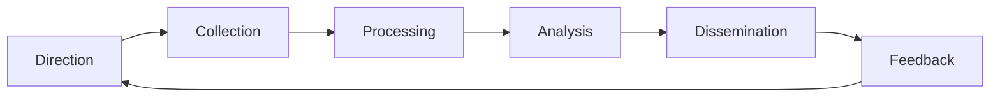

> [!abstract] Definisi
> Dunia intelijen memiliki metodologi, disiplin, dan produk yang jauh lebih luas daripada sekadar kumpulan tools. Dokumen ini membedah *tradecraft* — bagaimana intelijen dikumpulkan (INTs), diproses (intelligence cycle), dianalisis (structured analytic techniques), dan dilaporkan (finished intelligence). Melengkapi osint-resource-index.md (daftar situs) dan intelligence-analyst-workstation-toolkit.md (workstation) dengan lapisan *metodologi* di atas tools.

---

## 📑 Daftar Isi

1. [[#1. Intelligence Cycle — Siklus Intelijen]]
2. [[#2. Disiplin Koleksi — INTs]]
3. [[#3. All-Source Intelligence & Fusion]]
4. [[#4. Produk Intelijen — Finished Intelligence]]
5. [[#5. Tradecraft Analisis — Structured Analytic Techniques]]
6. [[#6. Bias & Cognitive Traps]]
7. [[#7. Etika & Hukum]]
8. [[#8. Sumber Terbuka Utama]]
9. [[#9. Intelijen dalam Dunia Digital & Siber]]
10. [[#10. Studi Kasus: Bellingcat & Investigasi Terbuka]]

---

## 1. Intelligence Cycle — Siklus Intelijen

Siklus intelijen adalah proses standar yang mengubah kebutuhan menjadi produk.

| Fase | Aktivitas | Output |
|---|---|---|
| **Direction** | Menentukan kebutuhan intel (intelligence requirements) | Requirements list |
| **Collection** | Mengumpulkan data dari semua disiplin | Data mentah |
| **Processing** | Normalisasi, decoding, terjemahan, enrichment | Data siap analisis |
| **Analysis** | Integrasi, evaluasi, penilaian, proyeksi | Intelligence product |
| **Dissemination** | Distribusi ke decision maker | Finished intelligence |
| **Feedback** | Evaluasi produk, update requirements | Revised requirements |

> [!important]
> Siklus ini **bukan linear** — di praktik nyata berjalan iteratif dengan feedback loop. "Direction" yang buruk (requirement tidak jelas) menghasilkan koleksi yang boros dan analisis yang meleset. Ini kesalahan paling umum di semua level.

---

## 2. Disiplin Koleksi — INTs

Intelijen dikumpulkan melalui disiplin berbeda (INTs) — masing-masing punya kekuatan dan blind spot.

| Disiplin | Sumber | Kekuatan | Kelemahan |
|---|---|---|---|
| **OSINT** (Open Source) | Publik: web, media, data terbuka | Legal, murah, cepat | Terbatas pada yang terbuka |
| **SIGINT** (Signals) | Komunikasi, emisi, radar | Volume besar, real-time | Butuh akses, ilegal tanpa otorisasi |
| **HUMINT** (Human) | Manusia, informan, defector | Konteks, intent, budaya | Subjektif, berbahaya, mahal |
| **GEOINT** (Geospatial) | Citra satelit, peta, geodata | Visual, kontekstual | Tergantung cuaca/tutupan |
| **MASINT** (Measurement) | Sensor fisik: seismik, akustik, nuklir | Deteksi tersembunyi | Kompleks, mahal |
| **FININT** (Financial) | Aliran dana, transaksi | Motif ekonomi | Privasi, akses terbatas |

> [!tip] Untuk analis OSINT
> OSINT adalah satu-satunya disiplin yang **legal, murah, dan bisa dijalankan individu**. Kombinasi OSINT + analisis terstruktur sudah menghasilkan intelijen berkualitas untuk investigasi terbuka (contoh: Bellingcat).

---

## 3. All-Source Intelligence & Fusion

Disiplin tunggal tidak pernah cukup — intelijen terbaik menggabungkan semua sumber.

| Metode | Deskripsi |
|---|---|
| **All-source fusion** | Gabungkan OSINT + SIGINT + HUMINT + GEOINT untuk 1 gambaran |
| **Cross-cueing** | Satu INT mengarahkan yang lain (OSINT menemukan target → SIGINT memonitor) |
| **Source reliability** | Nilai keandalan sumber (A-F) x informasi confidence (1-6) |

> [!note] Skala penilaian Admiralty (NATO)
> | | | |
> |---|---|---|
> | **Keandalan Sumber:** A (selalu dapat dipercaya), B (biasanya), C (cukup), D (tidak biasanya), E (tidak dapat dipercaya), F (tidak dapat dinilai) |
> | **Keandalan Informasi:** 1 (dikonfirmasi), 2 (mungkin benar), 3 (mungkin), 4 (diragukan), 5 (kemungkinan tidak benar), 6 (tidak dapat dinilai) |

---

## 4. Produk Intelijen — Finished Intelligence

Output analis bukan data mentah — melainkan *finished intelligence* yang siap keputusan.

| Produk | Deskripsi | Contoh |
|---|---|---|
| **Current intelligence** | Situasi terkini, cepat | Daily briefing, PDB (President's Daily Brief) |
| **Estimative intelligence** | Proyeksi masa depan | NIE (National Intelligence Estimate) |
| **Basic intelligence** | Fakta dasar referensi | Encyclopedia, country handbooks |
| **Warning intelligence** | Peringatan dini ancaman | Threat warning |
| **Research intelligence** | Analisis mendalam topik | Research papers, monographs |

**Struktur laporan intelijen standar:**
1. **Executive summary** — so-what dalam 1 paragraf.
2. **Key judgments** — kesimpulan utama dengan confidence.
3. **Evidence** — sumber primer, timestamp, source reliability.
4. **Assessment** — makna, implikasi, proyeksi.
5. **Recommendations** — opsi + trade-off.

> [!danger] Aturan emas
> Laporan intelijen yang baik **memisahkan fakta dari penilaian** dan **menyebutkan confidence**. Laporan yang tidak menyebutkan tingkat keyakinan adalah opini, bukan intelijen.

### Confidence dalam estimatif intelijen

| Confidence | Makna | Contoh rentang |
|---|---|---|
| **Almost certain** | Hampir pasti | 93-99% |
| **Probable** | Kemungkinan besar | 55-80% |
| **Roughly even chance** | Setengah-setengah | 45-55% |
| **Unlikely** | Kecil kemungkinan | 20-45% |
| **Remote** | Sangat kecil | 1-20% |

> Estimasi yang menyebut confidence memungkinkan decision maker menimbang risiko. Estimasi tanpa confidence adalah ramalan — bukan intelijen.

---

## 5. Tradecraft Analisis — Structured Analytic Techniques

Analisis intelijen bukan intuisi — ia teknik terstruktur untuk melawan bias.

| Teknik | Fungsi | Kapan Dipakai |
|---|---|---|
| **AHC (Analysis of Competing Hypotheses)** | Uji semua hipotesis sekaligus | Masalah kompleks, banyak penjelasan |
| **Devil's advocacy** | Serang kesimpulan sendiri | Sebelum finalisasi |
| **Red teaming** | Lawan tim untuk menguji asumsi | Analisis penting |
| **Premortem** | Bayangkan kegagalan, cari penyebab | Sebelum keputusan besar |
| **Key assumptions check** | Eksplisitkan asumsi | Awal analisis |
| **Indicators** | Tentukan sinyal yang mengubah penilaian | Monitoring |

> [!important] AHC dalam praktik
> 1. Tulis semua hipotesis (jangan hanya yang favorit).
> 2. Buat matriks: hipotesis x bukti (baris = bukti, kolom = hipotesis).
> 3. Nilai konsistensi tiap bukti vs tiap hipotesis (konsisten? tidak relevan? kontradiktif?).
> 4. **Hapus hipotesis yang paling tidak didukung** — jangan hanya mencari bukti yang menguatkan favorit.
> 5. Uji kekuatan setiap bukti: apakah **pembeda** atau hanya **penyerta**? Jika satu bukti mendukung semua hipotesis, itu bukan bukti pembeda.
> 6. Jika hanya tersisa satu hipotesis, periksa kembali apakah hipotesis alternatif lain belum dipertimbangkan.

**Contoh matriks AHC (kasus WAF alert):**

| Hipotesis / Bukti | Anomali wajar | Serangan SQLi | Misconfig |
|---|---|---|---|
| 1. Banyak request gagal 403 | ✅ | ✅ | ❌ |
| 2. Payload SQL di body | ❌ | ✅ | ❌ |
| 3. Setelah deploy baru | ✅ | ✅ | ✅ |
| **Penilaian** | Kurang | **Paling kuat** | Lemah |

> AHC memaksa analis menyenaraikan semua hipotesis — bukan menempel pada yang pertama terpikir.

---

## 6. Bias & Cognitive Traps

Analis adalah manusia — bias selalu ada. Kesadaran adalah pertahanan pertama.

| Bias | Deskripsi | Mitigasi |
|---|---|---|
| **Confirmation bias** | Hanya cari bukti yang menguatkan | AHC, devil's advocacy |
| **Anchoring** | Terpaku pada angka/info pertama | Mulai dari blank slate |
| **Groupthink** | Tekanan tim untuk konsensus | Red team, anonimitas |
| **Mirror-imaging** | Asumsikan musuh berpikir seperti kita | Studi budaya/konteks |
| **Recency** | Informasi terbaru terlalu dihargai | Beri bobot temporal |
| **Availability** | Yang mudah diingat dianggap umum | Cari data base rate |

> [!warning]
> Bias paling berbahaya adalah bias yang **tidak disadari**. Tuliskan eksplisit asumsi dan bukti yang bisa mengubah kesimpulanmu — jika tidak ada bukti yang bisa mengubahnya, kamu sudah terjebak dogma.

---

## 7. Etika & Hukum

Disiplin intelijen berjalan di batas etika dan hukum — terutama untuk individu.

| Aspek | Aturan |
|---|---|
| **Legal** | Pengumpulan SIGINT tanpa otorisasi ilegal di hampir semua jurisdiksi |
| **HUMINT** | Informan harus sukarela & paham risiko |
| **Data privacy** | Data pribadi wajib dilindungi (GDPR, UU PDP) |
| **OSINT etis** | Hanya gunakan sumber terbuka yang legal |
| **Publikasi** | Jangan expose informan / teknik aktif |

> [!danger]
> OSINT legal selama sumbernya publik. **SIGINT terhadap komunikasi privat, akses tidak sah, dan doxing ilegal.** Riset intelijen yang etis berhenti di sumber terbuka + analisis — bukan eksploitasi.

---

## 8. Sumber Terbuka Utama

Daftar situs per negara ada di [[osint-resource-index]]. Berikut yang paling sering dipakai analis:

| Kategori | Sumber |
|---|---|
| **Think tanks** | RAND, CSIS, IISS, Brookings, Chatham House, SIPRI |
| **Intel archives** | CIA FOIA Reading Room, NSA Declassification, FBI Vault |
| **Investigasi** | Bellingcat, OCCRP, Dossier Center |
| **Data global** | World Bank, UN Data, IMF, SIPRI Yearbook |
| **Perusahaan intel** | Recorded Future, Mandiant, CrowdStrike reports |
| **Platform OSINT** | Shodan, Maltego, SpiderFoot, theHarvester |

> [!tip] Mengutip think tank
> Think tank punya bias institusional — cek pendanaan, metodologi, dan konteks. RAND dan SIPRI dikenal rigor; lainnya bervariasi. Selalu cross-check dengan sumber independen.

---

## 9. Intelijen dalam Dunia Digital & Siber

Intelijen siber adalah aplikasi tradecraft klasik ke domain digital.

| Konsep | Deskripsi |
|---|---|
| **CTI (Cyber Threat Intelligence)** | Intelijen tentang ancaman siber: aktor, TTP, IoC |
| **TTP** | Tactics, Techniques, Procedures — cara aktor beroperasi |
| **IoC (Indicators of Compromise)** | Bukti teknis kompromi: hash, IP, domain |
| **Kill chain / ATT&CK** | Tahapan serangan / knowledge base MITRE |
| **Diamond model** | Analisis hubungan adversary-capability-infrastructure-victim |
| **Threat intel sharing** | MISP, STIX/TAXII, TLP (Traffic Light Protocol) |
| **Adversary infrastructure** | Analisis infrastruktur C2, domain, IP |

**Contoh pipeline CTI sederhana:**

1. **Collection** — pull IoC dari feed (AlienVault OTX, MISP, threat feed terbuka).
2. **Normalisasi** — pindah ke format STIX JSON seragam.
3. **Enrichment** — tambah konteks: ASN, geo, Whois, port, domain age.
4. **Correlation** — hubungkan ke threat actor & campaign via ATT&CK.
5. **Production** — buat alert/signature/IoC blocklist dengan TLP labeling.
6. **Feedback** — update coverage, cek false positive.

### Threat Intelligence Platforms (TIP)

| Platform | Tipe | Catatan |
|---|---|---|
| MISP | Open-source, self-hosted | Standar de facto CTI sharing |
| OpenCTI | Open-source | Knowledge graph + STIX2 |
| AlienVault OTX | Gratis/komersial | Feed IoC + pulse |
| VirusTotal Enterprise | Komersial | Enrichment IoC |
| Recorded Future | Komersial | AI-driven intel |

> AlienVault OTX dan Project Zero adalah feed gratis yang bagus untuk belajar CTI.

> [!note]
> TLP adalah standar penting: **RED** (hanya individu), **AMBER** (organisasi + klien), **GREEN** (komunitas), **WHITE** (publik). Selalu hormati TLP saat berbagi intel.

---

## 10. Studi Kasus: Bellingcat & Investigasi Terbuka

Bellingcat adalah contoh OSINT + analisis terstruktur menghasilkan intelijen kelas dunia.

| Kasus | Metode |
|---|---|
| **MH17 (2014)** | Geolokasi foto + media sosial + open-source → bukti lokasi peluncuran |
| **Novichok (2018)** | Analisis kemasan parfum + identifikasi lokasi |
| **Skripal poisoning** | Kombinasi GEOINT + OSINT + open-source forensik |
| **Wagner Group** | Identifikasi individu dari foto + data publik |

**Pelajaran dari Bellingcat:**
1. Setiap klaim punya bukti open-source yang bisa diverifikasi.
2. Geolokasi (geolocation) adalah teknik paling kuat — cocokkan landmark.
3. Timeline + cross-verification = bukti yang sulit dibantah.
4. Metodologi yang terbuka = kredibilitas.

> [!tip]
> Untuk memulai investigasi: ambil 1 foto, coba geolocate dengan Google Earth + Street View + pencarian landmark. Ini latihan terbaik untuk mentalitas analis.

---

## Referensi & Cross-link

- [[osint-resource-index]] — daftar situs intelijen per negara
- [[intelligence-analyst-workstation-toolkit]] — pipeline tools analis
- [[academic-research-sources-encyclopedia]] — sumber akademik
- [[primary-sources-and-archival-research]] — bukti primer & declassified
- [[hierarchy-intelligence-sources-ecosystem]] — peta hierarki sumber
- [[hierarchy-osint-rf]] — OSINT & RF collection
- [[research-methodology]] — metodologi riset umum

**Metadata**

- **Tags:** intelligence tradecraft analysis cycle humint sigint osint reporting
- **Related:** [[osint-resource-index]], [[intelligence-analyst-workstation-toolkit]], [[hierarchy-intelligence-sources-ecosystem]]
- **Last Updated:** 2026-08-02
---

audited
---
